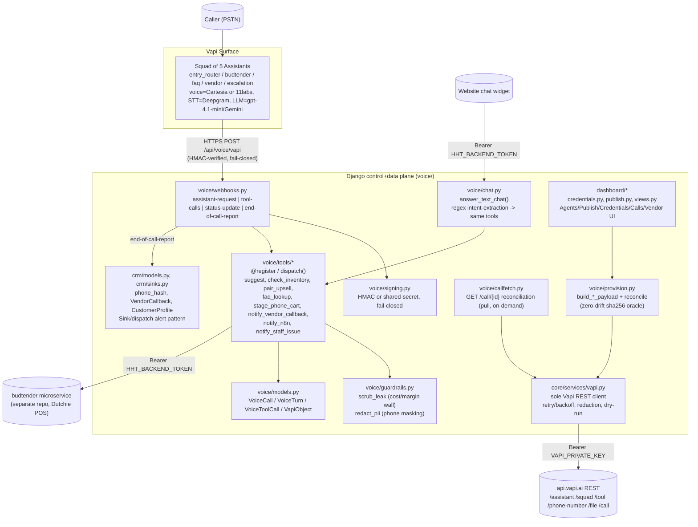

# Audit: happytime-budtender/voice — Vapi integration reuse for swedish-bot

> Read-only audit. Source: `C:\Users\vladi\OneDrive\Desktop\happytime-budtender\voice\` (a Django
> project, "happytime-voice"). Target: `C:\Users\vladi\OneDrive\Desktop\swedish-bot\` (Nordland VVS,
> a Swedish HVAC support chatbot — Django, apps `chat/`, `crm/`, `kb/`, `dashboard/`, `core/services/`).
> Written 2026-07-12.

**Important framing fact discovered during the audit**: this is not a one-way lift. `voice/`'s own
docstrings say it was *forked from swedish-bot* (`01-ARCHITECTURE.md §2`: "New repo folder layout
(fork swedish-bot)") and multiple modules are explicitly "ported verbatim" from swedish-bot
(`crm/models.py::phone_hash`, `crm/sinks.py`'s Sink/dispatch pattern, `AlertDelivery` ← swedish-bot's
`LeadDelivery`, `VoiceCall` docstring: "Mirrors swedish-bot's Session/ServiceRequest durability +
idempotency idioms"). So swedish-bot already has: `crm/models.py` with a `phone_hash`-style pepper
pattern, a `Sink`/`dispatch` alert pattern, `chat/uploads.py::sanitize_image` (EXIF-stripping image
re-encode), a `dashboard/` app, and `core/services/` for external API clients. **The net-new surface
this audit is really scoping is the Vapi (phone/voice) layer** — webhook handling, assistant
provisioning, the tool-call bridge, and the credentials/publish UI — none of which exist in
swedish-bot today.

---

## Executive summary

`voice/` is a mature (P0–P6 shipped, ~434 tests), well-documented Django app that wraps Vapi's phone
platform around a shared tool-dispatch layer also used by a website text-chat endpoint. The
architecture is **directly portable** in shape:

- **Webhook contract** (`voice/webhooks.py` + `voice/signing.py`) — HMAC/secret-verified, dispatches
  on Vapi's 4 server-message types, is transport-agnostic from the tool layer's point of view. Port
  as a new Django app/module almost unchanged; only the store-routing and squad-topology specifics
  are dispatchery-specific.
- **Everything-as-code provisioning** (`voice/provision.py` + `core/services/vapi.py`) — a
  reconcile-by-name-then-id engine with a zero-drift sha256 hash oracle, shared verbatim between the
  CLI provisioner and the dashboard's "Publish to Vapi" button (`dashboard/publish.py` literally calls
  `provision.build_assistant_payload`/`build_squad_payload` — one payload builder, two callers). This
  is the single highest-value piece to lift: it turns "manually configure an assistant in the Vapi
  UI" into "edit a Django row, click Publish, it's live" — exactly what the HVAC project wants for an
  admin dashboard config surface.
- **Tool dispatch framework** (`voice/tools/__init__.py`) — a tiny `@register`/`dispatch()` registry
  with a central leak-scrub wall (`guardrails.scrub_leak`) applied to every result regardless of which
  tool ran. Trivial to port; the individual tool handlers (suggest/inventory/vendor/n8n/phone_cart) are
  domain-specific to cannabis retail and won't transfer, but `notify_n8n` (`voice/tools/n8n.py`) is a
  near-verbatim template for an n8n-trigger tool in the HVAC bot.
- **Credentials + control-plane dashboard** (`dashboard/credentials.py`, `dashboard/publish.py`) — a
  catalog-driven secrets editor that live-applies to `os.environ`/`settings` with zero redeploy, plus
  an instant-publish-on-save flow. Directly reusable pattern for exposing Vapi/n8n/ElevenLabs config
  in swedish-bot's own `dashboard/` app (which currently has no credentials UI).
- **Call/tool-call durable log** (`voice/models.py`, `crm/sinks.py`) — `VoiceCall`/`VoiceTurn`/
  `VoiceToolCall` + a pluggable `Sink`/`dispatch()` alerting pattern with a `(record, sink)`
  idempotency ledger. This is the SAME pattern already in swedish-bot's `crm/` (per the porting
  history above) — expect to *extend* swedish-bot's existing CRM models with call-specific fields
  rather than introduce a parallel model set.

**What's genuinely missing and must be designed fresh** (Gaps, §8): WhatsApp media ingestion, mid-call
image-context injection into a live Vapi call, ElevenLabs-in-a-web-widget (voice/ only does ElevenLabs
via Vapi's phone channel, never a browser widget), and any concept of linking a phone call to a
website chat session (voice/'s `chat.py` and `webhooks.py` are two independent entry points into the
same tool layer — they do not share a session/customer identity across channels).

---

## Architecture overview



Four planes (per `docs/plans/01-ARCHITECTURE.md`): **Vapi surface** (conversation runtime),
**control plane** (dashboard → Vapi REST publish), **data plane** (voice ⇄ budtender HTTP contract),
**KB plane** (Django `kb/` models + a Vapi Files/Query-tool mirror — swedish-bot already has an
equivalent `kb/` app).

---

## 1. Vapi webhook handling (`voice/voice/webhooks.py`, `voice/voice/signing.py`)

Single entrypoint `vapi_webhook(request)` at `POST /api/voice/vapi`, `@csrf_exempt` (HMAC/secret-authed,
not cookie-authed) `@require_POST`. Dispatch table:

```python
_DISPATCH = {
    "assistant-request": handle_assistant_request,
    "tool-calls": handle_tool_calls,
    "status-update": handle_status_update,
    "end-of-call-report": handle_end_of_call_report,
}
```

- **Signature verification runs FIRST**, fails closed with 401 before any body parsing
  (`signing.verify_signature`). Two modes, both `hmac.compare_digest` (constant-time):
  - Mode A: `X-Vapi-Signature: hex(hmac_sha256(secret, raw_body))`.
  - Mode B: `X-Vapi-Secret: <VAPI_WEBHOOK_SECRET>` (shared-secret echo).
  - An **unconfigured secret rejects** rather than opening the gate — fail-closed by construction.
- **`assistant-request`**: not actually a valid Vapi server message in this squad topology (comment:
  "assistants here are pre-provisioned squad members, so it isn't needed") but the handler exists —
  resolves store from phone-number-id → returns `{assistantId, assistantOverrides:{variableValues:{...}}}`
  so no literal `{{store_name}}` template ever ships unhydrated.
- **`tool-calls`**: extracts tool calls tolerantly from either `message.toolCalls` or
  `message.toolCallList` (`_extract_tool_calls`, normalizes JSON-string args to dict), routes each
  through `voice.tools.dispatch(name, args, ctx)`, asserts no leak survived
  (`guardrails.assert_no_leak`), returns the Vapi tool-result envelope:
  ```python
  return JsonResponse({"results": [{"toolCallId": tc["id"], "result": result}, ...]})
  ```
  Also logs every invocation to `VoiceToolCall` (args PII-masked + leak-scrubbed, result already
  leak-scrubbed) — best-effort, never breaks the tool response on a logging failure.
- **`status-update`**: appends a `VoiceTurn` when a transcript fragment is present (in-flight
  transcript streaming); always acks `200 {}`.
- **`end-of-call-report`**: the durable-record path (ADR-017 in that repo) — order is binding:
  (1) synchronous idempotent `VoiceCall.objects.update_or_create(call_id=...)` + turns + phone-hash
  (record survives even if later steps fail), (2) deterministic outcome classification
  (`voice.outcomes.classify_outcome` — code owns the label, not the LLM), (3) post-call work
  (summary + staff digest) via Celery when `HHT_USE_CELERY=1`, else synchronous inline. Always
  returns `200 {}`.

`SERVER_MESSAGES = ["tool-calls", "status-update", "end-of-call-report"]` (constants.py) — this is
what gets provisioned onto the assistant so Vapi actually sends these three.

**Reusability**: the signing module and dispatch skeleton are directly portable — swap the
store-routing helpers (`_resolve_store`, `_VALID_STORES`) for whatever routing concept the HVAC bot
needs (region/service-area, or just a single tenant). The tool-call and eocr handlers' shape
(extract → dispatch → scrub → log → respond) is domain-agnostic.

## 2. Vapi API client & provisioning

### `core/services/vapi.py` — the one client
Module-functional REST client, `BASE_URL = "https://api.vapi.ai"`, Bearer `VAPI_PRIVATE_KEY`. Verb
primitives `get/post/patch/delete` funnel through one `_request()` with: exponential backoff + jitter
on `{429,500,502,503,504}` (honors `Retry-After`), a typed `VapiError(status, body, method, path)`,
secret redaction on every log line and error body, and a **dry-run recorder** — non-GET writes are
captured in `recorded_calls` and return a synthetic id when `VAPI_PRIVATE_KEY` is unset, so the
reconcile logic runs offline/in CI without live calls. Typed CRUD helpers exist for
assistant/squad/tool/phone-number/file/**call** (read-only, `get_call`/`list_calls` — the fetch-back
path) and a beta `/workflow` surface. `auth_ok()` is a cheap `GET /assistant?limit=1` reachability
probe powering `/healthz`.

### `voice/provision.py` — everything-as-code + zero-drift reconcile
The core reusable primitive. `build_tool_payload`, `build_assistant_payload`, `build_squad_payload`
are the single source of truth for Vapi JSON shapes, **shared with `dashboard/publish.py`** (confirmed
during this audit: `publish.py`'s builders delegate directly to `provision.py`'s — one payload
builder, two callers, not a parallel implementation).

`build_assistant_payload(role, *, name=None) -> (payload, warnings)` reads model/voice/prompt from a
DB row (`kb.models.AgentPrompt`) with constants as bare-tree fallback:
```python
model: dict = {
    "provider": model_provider,   # AgentPrompt.model_provider or C.ASSISTANT_PROVIDER
    "model": model_id,            # AgentPrompt.vapi_model or C.ASSISTANT_MODEL
    "temperature": temperature,
    "maxTokens": max_tokens,
    "messages": [{"role": "system", "content": body_text}],
    "toolIds": tool_ids,
}
payload = {
    "name": name or role, "model": model,
    "voice": _voice_block(prompt),           # Cartesia default; switches to "11labs" from a row
    "transcriber": dict(C.DEEPGRAM_TRANSCRIBER),
    "server": _server_block(),               # {"url": PUBLIC_BASE_URL + WEBHOOK_PATH, "secret": VAPI_WEBHOOK_SECRET}
    "serverMessages": list(C.SERVER_MESSAGES),
}
```
The **zero-drift reconcile**: `_reconcile(kind, name, payload, find_by_name, get_by_id, create, patch)`
resolves the existing object (stored id → find-by-name fallback), computes
`sha256(canonical_json(redact_payload(payload)))`, and short-circuits with **zero Vapi writes** when
the hash matches `VapiObject.last_provision_hash` — "a re-run is a proven no-op" (ADR-003 in that
repo, tested). Order is mandatory: tools → files → assistants → squad → phone-number attach. A tool
not yet provisioned skips its assistant rather than sending a dangling `toolId`.

`build_squad_payload(member_names)` emits `assistantDestinations` from a **code-defined** topology
(`C.SQUAD_SHAPE`, a dict of role → `[(dest_role, description), ...]`), never from free canvas editing
— "guardrails cannot be deleted from the UI." Only edges whose both endpoints are provisioned are
emitted, so the topology grows incrementally as members are seeded.

`voice/constants.py` documents the "member-level config, set ONCE per assistant, never per node"
discipline (ADR-011 in that repo) — the source export had duplicated voice/transcriber/model 51× per
node; this fixes that by construction. `TOOL_SPECS: dict[str, dict]` is the JSON-Schema parameter
declaration per tool name (shared by `build_tool_payload` and the runtime arg-sanitizer in
`voice/tools/__init__.py::_sanitize_args`).

### Control-plane concept (`docs/plans/25-P6-control-plane.md`)
P6 shipped: (1) dashboard edits actually reach Vapi (fixed a bug where `build_assistant_payload`
ignored the saved row), (2) swappable model provider (Gemini default, per-role override), (3)
ElevenLabs voice switch from the dashboard (`voice_provider`, `voice_id`, `voice_settings` JSON —
"the field IS the extension seam" for provider-specific knobs), (4) **instant sync** — saving an
assistant auto-publishes via `HHT_AUTO_PUBLISH`, zero-drift keeps a no-edit save a cheap no-op, (5)
the credentials editor, (6) tool-call logging + on-demand full-conversation fetch from Vapi, (7) n8n
dual integration (sink + bot-callable tool), (8) customer-intelligence dashboard.

## 3. Tools framework (`voice/voice/tools/`)

`voice/tools/__init__.py` — tiny registry:
```python
TOOL_REGISTRY: dict[str, Callable[[dict, dict], dict]] = {}

def register(name: str):
    def _decorator(func): TOOL_REGISTRY[name] = func; return func
    return _decorator

def dispatch(name: str, args: dict, ctx: dict) -> dict:
    handler = TOOL_REGISTRY.get(name)
    if handler is None:
        return {"error": "unknown_tool", "tool": name}
    try:
        result = handler(_sanitize_args(name, args or {}), ctx or {})
    except Exception:
        return {"error": "tool_failed", "tool": name}
    return guardrails.scrub_leak(result)   # ← applied centrally, no per-tool opt-in
```
`_sanitize_args` is a minimal server-side JSON-Schema wall driven by `constants.TOOL_SPECS[name]` —
drops unknown keys, coerces/validates type + enum per declared property. Handlers self-register via
`@register("tool_name")` at import time; `voice/tools/__init__.py` bottom imports each handler module
(`faq, suggest, vendor, escalation, n8n, phone_cart`) purely to trigger registration.

`voice/tools/n8n.py::notify_n8n` — the most directly reusable tool for the HVAC port. Bearer-less,
fire-and-forget POST to `N8N_WEBHOOK_URL`:
```python
payload = {
    "event": "bot_action", "event_type": event_type,
    "summary": guardrails.redact_pii(summary),   # PII-masked before it leaves the system
    "store": store, "store_spoken": spoken_store(store) if store else "",
    "call_id": ctx.get("call_id", ""),
}
```
Degrades to `{"ok": False, "reason": "..."}` (unconfigured / HTTP≥300 / unreachable) rather than
raising — `dispatch()` already wraps handlers, but the tool keeps its own spoken-envelope clean.
`test_n8n_tool.py` pins: registered in `TOOL_REGISTRY`, degrades cleanly, posts the expected shape,
masks a phone number the model put in free text.

`crm/sinks.py::N8nSink` is the **other** n8n direction — fires on every completed call automatically
(not bot-triggered), independent of `notify_n8n`. Both exist; worth carrying the distinction into the
HVAC design ("bot decides to call n8n mid-call" vs "every call posts to n8n regardless").

`voice/tools/phone_cart.py::handle_stage_phone_cart` is a good template for *any* "stage an intent,
never write the source-of-truth system" tool — deliberately transport-only, never imports the POS/
Dutchie client directly, only calls `budtender().phone_cart_upsert/_release`.

`test_tool_call_log.py` confirms the webhook's `handle_tool_calls` persists **args + result** per
invocation (not just the tool name) to `VoiceToolCall`, keyed by the raw `call_id` string (not FK —
tool-calls can arrive before the `VoiceCall` row exists via eocr).

## 4. Call lifecycle & data

### `voice/voice/callfetch.py` — pull-based reconciliation (not polling)
`fetch_full_conversation(call_id)` calls `GET /call/{id}` on demand (dashboard button / management
command `full_conversation <call_id>`), not on a schedule. Extracts `parse_tool_calls(messages)` from
Vapi's `artifact.messages` (tolerant of `toolCalls`/`toolCallList`, matches results to invocations by
`toolCallId`), persists transcript/summary onto `VoiceCall` and every tool call into `VoiceToolCall`
(`source="vapi_fetch"`, idempotent `update_or_create`). This exists because the live webhook's
in-call transcript is a working copy; Vapi's own `GET /call/{id}` is the authoritative record after
the fact — useful pattern if the HVAC bot ever needs a "verify what actually happened on this call"
reconciliation view.

### `voice/voice/chat.py::answer_text_chat(data: dict) -> dict`
The **shared-brain, two-transport** pattern: Vapi calls get an HMAC-verified webhook wrapper; website
chat calls this function directly (Bearer-gated via `voice/api.py::text_chat`, no HMAC, no Vapi
transcript). It does NOT use an LLM function-call for intent — it hand-rolls regex intent/slot
extraction (`_HUMAN_RE`, `_CATEGORY_RE`, `_FAQ_FIRST_RE`, price/effect/subcategory extractors) in
Python, then calls the **exact same** `voice.tools.dispatch("faq_lookup"/"suggest_products", args, ctx)`
the voice tool-calls hit. This is the key architectural fact for the HVAC port: **one tool-dispatch
layer, multiple front-doors** (phone via Vapi webhook, website via direct call, and — for swedish-bot
— presumably WhatsApp via a third front-door that would call the same `dispatch()`).

### `voice/voice/models.py` (frozen shapes, "do NOT move after P1/P2/P3 fork against them")
```python
class VoiceCall(models.Model):
    call_id = CharField(unique=True, db_index=True)          # Vapi call.id — idempotency key
    store, caller_phone_hash, outcome, escalated, reason,
    human_requested_count, transfer_disposition, transfer_number_key,
    duration_s, transcript, ai_summary, assistant_id,
    suggested_skus = JSONField(default=list)

class VoiceTurn(models.Model):
    call = FK(VoiceCall, related_name="turns"); seq; role; text; tool_name; latency_ms
    class Meta: unique_together = [("call", "seq")]           # idempotent re-delivery

class VoiceToolCall(models.Model):
    call_id = CharField(db_index=True)   # NOT a FK — tool-calls arrive before eocr creates VoiceCall
    tool_call_id; name; args: JSONField; result: JSONField; store; source  # "webhook"|"vapi_fetch"
    class Meta: unique_together = [("call_id", "tool_call_id", "name")]

class VapiObject(models.Model):        # the provisioner's local id-map
    kind; name; vapi_id; last_provision_hash
    class Meta: unique_together = [("kind", "name")]
```

### `crm/models.py::phone_hash` — already in swedish-bot
```python
def phone_hash(phone: str) -> str:
    norm = "".join(c for c in (phone or "") if c.isdigit() or c == "+")
    pepper = getattr(settings, "PHONE_HASH_PEPPER", "")
    return hashlib.sha256((pepper + norm).encode()).hexdigest()
```
Docstring: "ported VERBATIM from swedish-bot/crm/models.py (L17-29)". swedish-bot's `PHONE_HASH_PEPPER`
env var and pattern already exist — **nothing to port here**, just extend usage to phone-call callers.

### `crm/sinks.py` — pluggable alert channels, also ported FROM swedish-bot
`Sink` base (`enabled(record) -> bool`, `deliver(record) -> None`); `SINKS = [DBSink(), EmailSink(),
SlackSink(), N8nSink()]`; `dispatch(voice_call) -> dict[str,str]` iterates them, idempotent per
`(record, sink)` via `crm.models.AlertDelivery` (`get_or_create`, short-circuits on prior success,
records `failed` on exception, never raises). `N8nSink` payload:
```python
{"event": "voice_call", "call_id", "store", "outcome", "reason", "escalated",
 "human_requested", "duration_s", "caller_hash": hash[:16], "suggested_skus", "summary"}
```
This is the pattern swedish-bot's own `crm/sinks.py` already implements for `ServiceRequest`/
`LeadDelivery`(per voice's docstrings) — the HVAC port's job is to *add* a voice-call-flavored sink
set alongside the existing one, or generalize `dispatch()` to take any record with an `outcome`.

## 5. Dashboard config surface

`dashboard/publish.py` and `voice/provision.py` share one payload-builder — confirmed no drift risk
between "CLI provision" and "dashboard publish." `dashboard/credentials.py` is the standout reusable
piece: a declarative `CREDENTIAL_CATALOG: list[dict]` (`{group, name, label, secret, help}`) rendered
as a grouped settings page; `set_credential(name, value)` writes a `Credential` DB row **and**
immediately does `os.environ[name] = value; setattr(settings, name, value)` — live, no redeploy;
`DashboardConfig.ready()` calls `apply_all()` at boot to re-assert DB overrides over `.env` defaults.
Explicit design note worth carrying forward: **provider API keys (ElevenLabs/Gemini) are NOT stored
here** — they live in Vapi's own dashboard because "there is no public Vapi credential API"; this
app's catalog only manages secrets *this app* needs to reach Vapi/n8n/etc.

`dashboard/urls.py` / `dashboard/views.py` — 20+ staff-only (`@staff_member_required`) routes:
agents editor (`agent_save` → `publish.auto_publish_on_save`), flow canvas (validated via
`dashboard/flowgraph.py::clean_graph`, config/docs only — not the source of truth, code is), KB
manager, ranking-weights tuner, call monitor/log/transcript/fetch-full, escalation review, vendor
callback queue, customer intelligence, and the credentials/publish pages. swedish-bot's `dashboard/`
app already exists but is much thinner (`apps.py, forms.py, migrations, urls.py, views.py` only, no
`credentials.py`/`publish.py`/`flowgraph.py` equivalents) — this is the biggest single feature gap to
fill for "config in an admin dashboard."

## 6. Settings & env

Every Vapi/n8n/credential-relevant env var referenced in `voice/config/settings.py` (grouped):
```
VAPI_PRIVATE_KEY, VAPI_WEBHOOK_SECRET, VAPI_SQUAD_ID, VAPI_PHONE_NUMBER_ID,
VAPI_PHONE_NUMBER_STORE_MAP, VAPI_VOICE_ID, VAPI_ASSISTANT_MODEL,
VAPI_SIGNATURE_HEADER, VAPI_SECRET_HEADER
N8N_WEBHOOK_URL
HHT_BUDTENDER_BASE_URL, HHT_BACKEND_TOKEN, HHT_BUDTENDER_TIMEOUT   (their downstream service — analog
                                                                     of swedish-bot's own domain APIs)
HHT_AUTO_PUBLISH
HHT_USE_CELERY, CELERY_BROKER_URL, CELERY_RESULT_BACKEND, CELERY_TASK_ALWAYS_EAGER
PHONE_HASH_PEPPER   (already in swedish-bot)
PUBLIC_BASE_URL, WIDGET_ALLOWED_ORIGINS
```
Fail-closed boot guard (`DEBUG=0` only): refuses to boot if `SECRET_KEY` is still the dev default, if
`PHONE_HASH_PEPPER == SECRET_KEY`, or if `VAPI_PRIVATE_KEY`/`VAPI_WEBHOOK_SECRET`/`HHT_BACKEND_TOKEN`
are unset — worth porting this exact discipline for `VAPI_PRIVATE_KEY`/`VAPI_WEBHOOK_SECRET` in
swedish-bot's settings.

`docker-compose.yml` (repo root, NOT inside `voice/`) runs voice as an independent stack alongside the
budtender stack: its own Postgres (`voice-db`), its own Redis (`voice-redis`) + Celery worker
(`voice-worker`, `HHT_USE_CELERY=1`), `voice-web` built from `./voice` with `env_file: ./voice/.env`
and forced overrides (`POSTGRES_HOST=voice-db`, `DJANGO_DEBUG=0`, `HTTPS_ENABLED=1`,
`HHT_BUDTENDER_BASE_URL=http://budtender.internal:8000`), exposed via host-mode Traefik labels (no
`ports:` published) at `voice.happytimeweed.com`. Volumes `./voice/data/uploads` and
`./voice/secrets:/app/secrets:ro`. This is a **sibling-service topology** (voice talks to budtender
over the internal Docker network via Bearer token) — analogous to how a swedish-bot Vapi layer would
sit alongside the existing `chat/`/`crm/` app in the same Django project rather than as a separate
service, since swedish-bot is a single Django project (unlike happytime's two-repo split).

## 7. Docs/plans worth carrying over (architecture decisions)

- **ADR-011** ("member-level Vapi config, set ONCE, never per node") — avoid the 51×-duplication bug
  the original Vapi canvas export had; provision at the Squad-member level.
- **ADR-017** (durable-record-first ordering in `end-of-call-report`) — write the idempotent DB row
  *before* any summary/email/sink work, so a downstream failure never loses the call record.
  `docs/plans/25-P6-control-plane.md` §"Order is mandatory."
- **ADR-020** (webhook routes tool calls by `function.name` via a registry, never inline `if/elif`).
- **"Guardrails cannot be deleted from the UI"** (`dashboard/publish.py` docstring) — Squad topology /
  required transitions are asserted from CODE on every publish, so a dashboard user editing the
  visual flow-canvas cannot silently remove a safety-critical transition (e.g. escalation routing).
  Directly relevant if swedish-bot's dashboard ever gets a flow-editor for the HVAC bot's routing.
- **Zero-drift idempotency oracle** (`sha256(canonical_json(redact_payload(payload)))` compared
  against a stored hash) — the single most reusable engineering pattern in this codebase; makes
  "publish" and "provision" both safe to run repeatedly with no side effects when nothing changed.
- **`docs/plans/29-PLAN-phone-cart-handoff.md`** — a clean worked example of the "voice stages
  intent, a separate system-of-record commits it" boundary (voice never calls `cart_submit`/Dutchie
  write APIs directly). If the HVAC bot ever needs a phone-in scheduling/quote flow, this doc is the
  template for keeping the voice layer read/stage-only.
- **`docs/plans/25-P6-control-plane.md`** — the full feature list of what "control plane" means in
  this codebase (instant sync, swappable model/voice provider, credentials editor, tool-call logging,
  n8n dual-direction, customer intelligence) — a good checklist when scoping swedish-bot's own
  control-plane phase.

---

## Port plan raw material

| Source file (happytime-budtender/voice) | What it does | Reuse verdict | Target location in swedish-bot |
|---|---|---|---|
| `voice/voice/webhooks.py` | Vapi webhook dispatch (4 message types), tool-call routing, eocr durable write | **Adapt** — port the dispatch skeleton + signature-first-fail-closed pattern; replace store-routing with HVAC's own scoping (single tenant or service-area) | new `voice/webhooks.py` (new Django app) |
| `voice/voice/signing.py` | HMAC/shared-secret verification, constant-time compare | **Lift as-is** (rename only) | new `voice/signing.py` |
| `core/services/vapi.py` | Sole Vapi REST client: retry/backoff, redaction, dry-run recorder, typed CRUD | **Lift as-is**, add `PHONE_HASH_PEPPER`-style env-var names for this project | `core/services/vapi.py` (swedish-bot already has `core/services/`) |
| `voice/voice/provision.py` | Payload builders + zero-drift reconcile engine | **Adapt** — keep the reconcile engine + hash-oracle verbatim; rewrite `constants.py`-sourced payload shapes (voice/model/tools) for the HVAC assistant | new `voice/provision.py` + `voice/constants.py` |
| `voice/voice/constants.py` | Voice/transcriber/model blocks, `TOOL_SPECS`, Squad topology | **Rewrite** — the cannabis-specific keyterm lists, tool specs, and Squad shape don't transfer; the *pattern* (module-level constants as single source of truth for provisioned shapes) does | new `voice/constants.py` |
| `voice/voice/tools/__init__.py` | `@register`/`dispatch()` registry + central leak-scrub + arg-sanitizer | **Lift as-is** (registry) + **adapt** (the specific `_FORBIDDEN_KEYS` leak-list is cannabis cost/margin-specific — swap for HVAC's own sensitive fields if any) | new `voice/tools/__init__.py` |
| `voice/voice/tools/n8n.py` | `notify_n8n` bot-callable tool, PII-masked, degrade-safe | **Lift as-is** (near verbatim — just the tool description text is domain-specific) | new `voice/tools/n8n.py` |
| `voice/crm/sinks.py` | `Sink`/`dispatch()` alert pattern with per-(record,sink) idempotency ledger, `N8nSink`, `EmailSink`, `SlackSink` | **Merge** — swedish-bot's `crm/sinks.py` already implements this pattern (voice ported it FROM swedish-bot); extend the existing sink set to cover `VoiceCall`-equivalent records rather than duplicate | existing `crm/sinks.py` |
| `voice/crm/models.py::phone_hash` | Peppered SHA-256 phone hash | **Already present** in swedish-bot `crm/models.py` — no action | n/a (already there) |
| `voice/voice/models.py` (VoiceCall/VoiceTurn/VoiceToolCall/VapiObject) | Durable call log + tool-call audit + provisioner id-map | **Adapt** — the shapes are a good template; likely add as new models in a new `voice/` app rather than into `chat/`, since call semantics (outcome, transfer_disposition, duration) differ from `chat.Conversation`/`Message` | new `voice/models.py` |
| `voice/voice/callfetch.py` | On-demand `GET /call/{id}` reconciliation | **Lift as-is** (pattern + most of the code) | new `voice/callfetch.py` |
| `voice/voice/chat.py::answer_text_chat` | Shared regex-based intent extraction feeding the same tool dispatch as voice | **Reference only** — swedish-bot's `chat/orchestrator.py` already plays this role for the website widget using an LLM-driven flow (`casestate.py`/`intake.py`), a different (better) design than voice's hand-rolled regex. Don't port the regex approach; DO port the principle of "one dispatch() layer, multiple front-doors" | n/a (design reference) |
| `dashboard/credentials.py` | Declarative credential catalog + live-apply to env/settings | **Lift as-is** (pattern + ~90% of code) | new `dashboard/credentials.py` |
| `dashboard/publish.py` | Publish-to-Vapi control-plane action, zero-drift, per-object fail-isolation | **Adapt** — reuses `provision.py`'s builders; port once `provision.py` is ported | new `dashboard/publish.py` |
| `dashboard/views.py` (agents/publish/credentials/calls routes) | Staff-only config + call-monitor UI | **Adapt** — port the credentials/publish/call-log view shapes; the KB manager/weights-tuner/customer-intelligence views are cannabis-specific and won't transfer | extend existing `dashboard/views.py` + `dashboard/urls.py` |
| `voice/config/settings.py` (fail-closed boot guard) | Refuses to boot in prod without `VAPI_PRIVATE_KEY`/`VAPI_WEBHOOK_SECRET`/backend-token set | **Lift as-is** (pattern) | extend swedish-bot `config/settings.py` |
| `docker-compose.yml` (voice stack section) | Sibling-service Docker Compose topology | **N/A — rewrite** | swedish-bot is a single Django project; a Vapi layer is a new app in the existing project, not a new service/stack |
| `docs/plans/25-P6-control-plane.md`, `01-ARCHITECTURE.md`, `29-PLAN-phone-cart-handoff.md` | Architecture decisions + control-plane feature checklist | **Reference only** | inform swedish-bot's own `docs/plans/*` phase docs |

---

## Gaps — what does NOT exist here and must be designed fresh

1. **WhatsApp media ingestion.** `voice/` has zero WhatsApp integration of any kind — no webhook, no
   media-download, no MIME handling for an inbound WhatsApp message. swedish-bot's own
   `chat/uploads.py::sanitize_image` (EXIF-strip, magic-byte validation, decompression-bomb guard) is
   the closest existing building block but it's designed for a synchronous browser file upload
   (`multipart/form-data` POST), not an async webhook-delivered WhatsApp media URL that needs to be
   fetched, downloaded, and associated with a phone number / conversation. This needs a new module —
   likely a WhatsApp Business API (Cloud API) webhook receiver that downloads media via the Graph API,
   runs it through `sanitize_image`, and stores it keyed by the caller's phone hash.

2. **Mid-call image-context injection.** Nothing in `voice/` lets an in-progress Vapi phone call
   "see" an image. Vapi's assistants are audio-only by design; there is no server-tool result type
   that carries an image into the live conversation context the way `chat.py`'s text answers do. The
   likely design shape (not present anywhere in this codebase, must be invented): (a) caller sends a
   WhatsApp photo *before or during* the call, keyed by phone-hash; (b) a Vapi tool (analogous to
   `check_inventory`) is called with the caller's phone number, looks up the most recent
   photo-derived analysis (e.g. from Gemini vision — swedish-bot already has `core/services/gemini.py`
   and presumably a vision-extraction step in `chat/orchestrator.py`/`intake.py` for the web widget)
   and returns a *text* summary the voice assistant can speak — the image itself never goes into the
   audio channel, only a derived textual fact. This "vision happens out-of-band, voice consumes the
   text result" pattern needs to be designed and is the single largest net-new piece of this project.

3. **ElevenLabs voice in a web widget.** `voice/` only ever uses ElevenLabs (or Cartesia) through
   Vapi's own phone/voice pipeline (`_voice_block` in `provision.py`) — there is no browser-based
   TTS/STT widget anywhere in this codebase; Vapi IS the voice layer for phone calls only. A
   web-widget voice experience (mic capture, streaming to ElevenLabs or a Vapi web SDK, playback) is
   a different integration entirely (likely Vapi's Web SDK, which this repo never touches) and has no
   precedent here to reuse beyond the credential-management pattern (§5) for where the API key lives.

4. **Linking a Vapi call to a chat session.** `voice/webhooks.py` and `voice/chat.py` are two
   independent entry points into the same tool-dispatch layer, but nothing unifies them: a caller who
   phones in and a visitor who chats on the website are tracked as entirely separate identities
   (`VoiceCall.call_id` vs `chat.Conversation.public_id`) with no join table, no shared session token,
   and no cross-channel handoff. `crm.models.Caller`/`CallSession` in voice/ are phone-only shells. If
   swedish-bot wants "the same customer's WhatsApp photo shows up when they later call," this join
   (phone-hash as the shared key across `Conversation`, `VoiceCall`, and a new WhatsApp-media model)
   does not exist anywhere in the source and must be designed — phone-hash is the natural candidate
   key since both `crm.models.phone_hash` (swedish-bot) and `voice/crm/models.py::phone_hash` already
   use the identical peppered-SHA-256 scheme.

---

## Risks

- **Scope creep on the reconcile engine.** `provision.py`'s zero-drift hash oracle is elegant but has
  real edge cases (stale id → 404 → fall through to find-by-name; a payload hash that's stable across
  runs only because `vapi.redact_payload` masks `secret` — any other volatile field added to a future
  payload shape must also be excluded from the hash or every run "drifts"). Port the engine, but budget
  time to re-verify the hash-stability property against whatever new payload shape the HVAC assistant
  needs (test coverage exists in `voice/tests/test_provision*.py` — port those test patterns too, not
  just the code).
- **Leak-guard is domain-specific and easy to under-port.** `guardrails.scrub_leak`'s
  `_FORBIDDEN_KEYS = {"cost","margin",...}` is cannabis-retail-specific. If the HVAC bot has its own
  sensitive fields (e.g. technician cost, wholesale part price, internal SLA numbers), the equivalent
  list must be defined explicitly — don't assume the wall transfers empty and therefore "safe by
  default"; it transfers *permissive* by default unless someone fills in the new domain's forbidden-key
  list.
- **Two-repo vs one-repo topology mismatch.** voice/ talks to a *separate* budtender microservice over
  Bearer-token HTTP specifically because happytime-budtender is a two-repo system. swedish-bot is a
  single Django project — a naive port risks introducing an unnecessary internal HTTP hop (a new
  "voice service" calling back into swedish-bot's own `chat`/`crm` apps over HTTP) where a direct
  Python import would do. Recommend building the Vapi layer as an in-process Django app calling
  `chat.orchestrator`/`crm` directly, not as a network service.
- **`HHT_AUTO_PUBLISH` instant-sync could surprise an operator.** Saving an assistant config
  immediately pushes to production Vapi. Fine for a solo operator (this repo's context) but worth an
  explicit on/off decision for swedish-bot before wiring `auto_publish_on_save` — a staging Vapi
  squad/assistant id is worth having before the first live publish.
- **Fail-closed webhook secret requirement will break local dev by default.** Both the webhook
  signature check and the settings boot-guard fail closed on an unset `VAPI_WEBHOOK_SECRET` — correct
  for prod, but the port needs the same dev/test bypass this repo uses (`HHT_TEST_SQLITE`-style flag
  or explicit test fixtures that set the secret) or local development stalls immediately.
- **`voice/chat.py`'s regex intent-extraction is NOT a good reuse candidate**, despite living right
  next to genuinely good patterns — swedish-bot's own LLM-driven `chat/orchestrator.py` is a more
  robust design already in place. Flag this explicitly so a future port doesn't "helpfully" copy the
  regex approach just because it's adjacent to the parts worth lifting.
