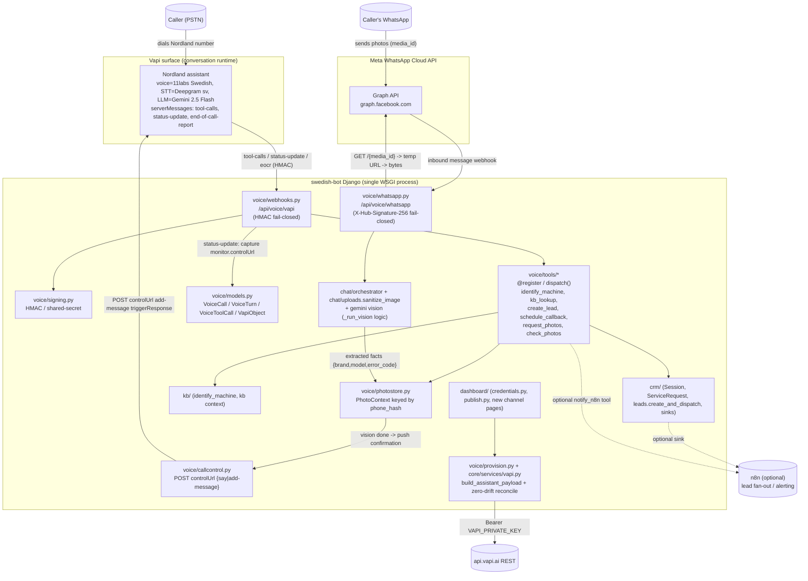

# Technical Design — Telephony Layer (Vapi phone + WhatsApp photo ingestion + n8n + dashboard config)

Nordland VVS Support Bot · `C:\Users\vladi\OneDrive\Desktop\swedish-bot`
Author: planning pass, 2026-07-12. **PLANNING ONLY — no source changed by this document.**

Upstream inputs (read in full before writing):
- `docs/plans/2026-07-12-audit-current-state.md` (the swedish-bot as-built audit)
- `docs/plans/2026-07-12-audit-budtender-voice-reuse.md` (the happytime-budtender `voice/` port audit)

Contracts verified directly against source during this pass: `chat/uploads.py::sanitize_image`,
`chat/casestate.py` (slots/`new_case_state`), `chat/orchestrator.py::_run_vision`/`_history_parts`,
`happytime-budtender/voice/voice/signing.py::verify_signature`. External capabilities verified via
Vapi + Meta docs (cited inline in §4/§5/§8).

---

## 0. TL;DR / decisions up front

1. **Repo topology**: one in-process Django app, `voice/`, inside swedish-bot. No sibling service, no
   internal HTTP hop. (§2)
2. **Photo-injection mechanism (the hard part)**: **push into the live call via Vapi Live Call
   Control** — Django POSTs an `add-message` (role `system`, `triggerResponseEnabled: true`) to the
   call's `controlUrl` the instant the vision pipeline finishes, so the agent *spontaneously* speaks
   the "I received 2 photos — I can see your IVT Greenline HE, error E21…" confirmation. A
   `check_photos` server tool is retained as a **cue-based fallback** (caller says "did you get it?")
   and for the case where `controlUrl` capture failed. (§5)
3. **n8n is optional glue, not load-bearing.** Every channel hop can be a direct Python call or a
   direct Meta/Vapi REST call from Django. n8n earns its place only as (a) the outbound lead/alert
   fan-out the owner can rewire without a deploy, and (b) an optional off-box WhatsApp-webhook shim if
   the owner prefers not to expose a second public endpoint. Recommendation: ship without n8n on the
   photo hot-path; add an `N8nSink` for leads to match the budtender pattern. (§1)
4. **WSGI stays.** Webhooks + WhatsApp media fetch + vision are all short-lived request/response work
   that fits sync gunicorn workers with a bumped worker/thread count. No Celery, no Redis. One
   management-command cron sweep already exists as precedent. (§9)
5. **Cross-channel key**: peppered `phone_hash` (already in `crm/models.py`) joins Vapi call ⇄
   WhatsApp media ⇄ web `Conversation`. (§6)

---

## 1. Architecture overview

### 1.1 Diagram



### 1.2 The five hops of the target experience

| # | Event | Component | Transport |
|---|---|---|---|
| 1 | Caller dials, Vapi answers with the Nordland persona | Vapi assistant (provisioned from DB) | PSTN → Vapi |
| 2 | Agent triages, calls `request_photos` mid-call | `voice/tools/request_photos` sends a WhatsApp template + speaks the number | Vapi `tool-calls` webhook → Django → Meta send API |
| 3 | Caller sends photos on WhatsApp | Meta delivers a webhook carrying `media_id`s | Meta → `voice/whatsapp.py` |
| 4 | Django fetches media, sanitizes, runs vision, stores facts keyed by `phone_hash` | `whatsapp.py` → `sanitize_image` → gemini vision → `PhotoContext` | in-process |
| 5 | Agent confirms "I received 2 photos — IVT Greenline HE, error E21…" | `callcontrol.py` POSTs `add-message` to the captured `controlUrl` | Django → Vapi control endpoint → live audio |

### 1.3 Is n8n load-bearing? — honest verdict

**No.** The photo hot-path (steps 2–5) must not route through n8n: every extra network hop adds latency
to a loop the design is fighting to keep under ~10 s, and n8n adds a second point of failure to a live
phone call. All of it is a direct Meta REST call and a direct Vapi REST call from Django — both are
things this app can do itself with `core/services/vapi.py` (ported) plus a ~30-line Graph API client.

n8n stays valuable in exactly two, decoupled, non-real-time places:

- **Outbound lead / alert fan-out** — replicate the budtender `crm/sinks.py::N8nSink` pattern: on
  `end-of-call-report` and on lead creation, fire a fire-and-forget POST to `N8N_WEBHOOK_URL`. This
  lets the owner wire "new escalated call → email me + append to a sheet + ping Slack" without a
  deploy. This is the same idempotent `(record, sink)` ledger already in swedish-bot
  (`ServiceRequest`/`LeadDelivery`).
- **Optional WhatsApp-webhook shim** — if the owner would rather not expose a second inbound public
  endpoint on the Nordland box (or wants to reuse an existing n8n WhatsApp trigger they already run),
  n8n can receive Meta's webhook and forward the normalized payload to `POST /api/voice/whatsapp`
  behind a shared secret. This is a deployment convenience, **not** an architectural requirement —
  ship the direct Meta→Django path by default.

Recommendation: **direct integrations on the hot path; n8n as a lead sink only, gated by
`N8N_WEBHOOK_URL` being set** (degrades to no-op when blank, exactly like the budtender tool).

---

## 2. Repo topology decision

**Decision: one in-process Django app `voice/` inside the existing swedish-bot project. Not a sibling
service.**

Rationale:
- swedish-bot is a **single Django project**. The budtender two-repo split (voice service ↔ budtender
  POS microservice over Bearer HTTP) exists only because happytime is two systems; the reuse audit
  explicitly warns against copying that topology (Risk: "a naive port risks introducing an unnecessary
  internal HTTP hop … where a direct Python import would do"). The voice layer needs `chat.uploads`,
  `chat` vision logic, `kb.identification`, and `crm.leads` — all direct imports in the same process.
- One Caddy vhost already fronts the app (`nordland.3dpresence.com`). New webhook endpoints are just
  new URL patterns behind the same reverse proxy — no new ingress, no new TLS cert.
- The zero-drift provisioner and credentials/publish dashboard pattern want to live next to the
  existing `dashboard/` app and read `kb.models.AgentPrompt` rows directly.

Consequence for §9 (WSGI): because it is in-process, the voice webhooks share the gunicorn worker pool
with the chat SSE endpoint — worker sizing is a shared concern, analyzed there.

New app registered in `INSTALLED_APPS` as `voice`. New URL include in `config/urls.py`:
`path("api/voice/", include("voice.urls"))`. CSRF-exempt on both webhook views (they are
signature-authed, not cookie-authed), mirroring the budtender `@csrf_exempt @require_POST` pattern.

---

## 3. New Django app layout (`voice/`)

Modules below, each with its responsibility and public interface. Port verdicts are lifted from the
reuse-audit port table and applied per-module.

```
voice/
  __init__.py
  apps.py               # VoiceConfig; ready() re-asserts DB credential overrides (see §7)
  constants.py          # NEW — assistant/voice/transcriber blocks, TOOL_SPECS, server-message list
  signing.py            # LIFT AS-IS (rename) — Vapi HMAC/shared-secret verify
  webhooks.py           # ADAPT — Vapi webhook dispatch (single tenant, no store routing)
  whatsapp.py           # NEW — Meta Cloud API webhook receiver + media fetch
  photostore.py         # NEW — PhotoContext store keyed by phone_hash; live-call join
  callcontrol.py        # NEW — POST to controlUrl (say / add-message)
  provision.py          # ADAPT — build_assistant_payload + zero-drift reconcile
  callfetch.py          # LIFT AS-IS — on-demand GET /call/{id} reconciliation
  outcomes.py           # ADAPT — deterministic call-outcome classifier (code owns the label)
  models.py             # ADAPT — VoiceCall / VoiceTurn / VoiceToolCall / VapiObject / PhotoContext
  urls.py               # NEW — /vapi, /whatsapp
  tools/
    __init__.py         # LIFT AS-IS — @register / dispatch() registry + central leak scrub + arg wall
    identify.py         # NEW — identify_machine tool (wraps kb.identification)
    kb.py               # NEW — kb_lookup tool (wraps chat/context knowledge collection)
    lead.py             # NEW — create_lead + schedule_callback tools (wrap crm.leads)
    photos.py           # NEW — request_photos + check_photos tools
    n8n.py              # LIFT AS-IS — notify_n8n bot-callable tool (optional)
  management/commands/
    provision_vapi.py   # NEW — CLI caller of provision.reconcile_all()
    full_conversation.py# NEW — CLI caller of callfetch.fetch_full_conversation(call_id)
  migrations/
```

`core/services/vapi.py` — **LIFT AS-IS** into swedish-bot's existing `core/services/` (it already
hosts `gemini.py`). Sole Vapi REST client: `get/post/patch/delete` → one `_request()` with
exponential backoff on `{429,5xx}`, typed `VapiError`, secret redaction, dry-run recorder when
`VAPI_PRIVATE_KEY` is unset. Adds `get_call(call_id)` (used by callfetch and control-url capture).

`crm/` — **EXTEND, do not fork.** Add the voice-flavored sink(s) to the existing `crm/sinks.py`
`SINKS` list; reuse `phone_hash` verbatim (already present); reuse the `ServiceRequest`/`LeadDelivery`
idempotency ledger for lead delivery. Add nothing parallel.

### 3.1 Public interfaces

**`voice/signing.py`** (verified shape from budtender):
```python
def compute_signature(raw_body: bytes, secret: str) -> str            # hex hmac_sha256
def verify_signature(request) -> tuple[bool, str]                     # (ok, reason); fail-closed
```
Fail-closed contract confirmed: unset secret → `(False, "webhook secret not configured")`; Mode A
`X-Vapi-Signature` HMAC compare; Mode B `X-Vapi-Secret` constant-time compare; no header → reject.
Header *names* env-driven (`VAPI_SIGNATURE_HEADER`, `VAPI_SECRET_HEADER`).

**`voice/webhooks.py`**:
```python
@csrf_exempt @require_POST
def vapi_webhook(request) -> JsonResponse
# 1. ok, reason = verify_signature(request); if not ok -> HttpResponse(status=401)
# 2. msg = json.loads(request.body)["message"]; dispatch on msg["type"]:
_DISPATCH = {
    "tool-calls":          handle_tool_calls,       # extract -> voice.tools.dispatch -> {"results":[...]}
    "status-update":       handle_status_update,    # capture monitor.controlUrl; append VoiceTurn
    "end-of-call-report":  handle_end_of_call_report,# durable write FIRST, then classify, then sinks
}
```
`handle_tool_calls` returns the Vapi envelope `{"results": [{"toolCallId": id, "result": <dict>}]}`.
`handle_status_update` is where `controlUrl` capture happens (§5).

**`voice/whatsapp.py`**:
```python
@csrf_exempt
def whatsapp_webhook(request):
    # GET  -> hub.challenge verification (Meta subscription handshake)
    # POST -> verify X-Hub-Signature-256 (HMAC-SHA256 of raw body w/ app secret); fail-closed
    #         for each message with type in {image, document}: enqueue_media(media_id, from_phone)
def fetch_and_ingest(media_id: str, from_phone: str) -> PhotoContext
    # GET graph/{media_id} (Bearer) -> {url}; GET url (Bearer) -> bytes;
    # sanitize_image(bytes) -> vision -> upsert PhotoContext; then maybe_push_to_live_call(phone_hash)
```
Inbound Meta message payload shape (the parts we consume):
```json
{ "entry": [{ "changes": [{ "value": {
  "messages": [{
    "from": "46701234567",
    "type": "image",
    "image": { "id": "<media_id>", "mime_type": "image/jpeg", "sha256": "..." }
  }]
}}]}]}
```

**`voice/photostore.py`**:
```python
def upsert(phone_hash: str, *, facts: dict, image_sha256: str, source_message=None) -> PhotoContext
def latest_for(phone_hash: str, *, max_age_s: int = 900) -> PhotoContext | None
def bind_call(phone_hash: str, call_id: str, control_url: str) -> None   # link WA identity to live call
def maybe_push_to_live_call(phone_hash: str) -> bool                     # §5 push path
```

**`voice/callcontrol.py`**:
```python
def say(control_url: str, content: str, *, end_call_after=False) -> bool
def add_message(control_url: str, content: str, *, role="system",
                trigger_response=True) -> bool
# POST {control_url} body {"type":"add-message","message":{"role":role,"content":content},
#                          "triggerResponseEnabled": trigger_response}
```

**`voice/tools/__init__.py`** (lift as-is):
```python
TOOL_REGISTRY: dict[str, Callable[[dict, dict], dict]] = {}
def register(name): ...                      # decorator, registers at import
def dispatch(name, args, ctx) -> dict:       # arg-sanitize -> handler -> guardrails.scrub_leak
```
`ctx` carries `{"call_id", "caller_phone", "phone_hash", "control_url"}` assembled by the webhook.

---

## 4. Vapi assistant design

### 4.1 System prompt derivation

The assistant's system prompt is **not** hand-written in Vapi — it is **derived from the existing
`kb.models.AgentPrompt` rows** and published via `provision.build_assistant_payload`, exactly the
budtender pattern (`payload["model"]["messages"][0] = {"role":"system","content": body_text}`).

Two viable derivations; recommend **(B)**:
- (A) New `AgentPrompt` role `"voice"` — a bespoke prompt. Costs a new conftest classifier phrase
  (audit gotcha #9) and drifts from the web persona.
- (B) **Compose the voice system prompt from the existing web roles** at publish time: take the
  `specialist` persona/scope/guardrail language as the spine, prepend a short voice-delta preamble
  ("You are on a phone call. Speak Swedish. One question at a time. Never read out error codes as
  digits unless asked. You cannot see images; when the caller has a photo, call `request_photos`.").
  This keeps a **single source of truth for persona/scope** (triage + info-gather + escalate; never
  hard repairs) and inherits the ADD-ONLY guardrail block. The voice-delta preamble is one new short
  `AgentPrompt` row of role `"voice_preamble"` (or a constant) — small, and only *additive* to the
  shared persona.

Guardrail continuity: the hardcoded `chat/guardrails.py` keyword veto does **not** run inside Vapi's
LLM turn (that LLM is Vapi-side). Safety is preserved two ways: (1) the persona/scope text carried
into the prompt already refuses electrical/refrigerant/pressure/combustion work, and (2) every
**server tool result** returned from Django is the only channel that can introduce KB/troubleshooting
content, and those results pass through the same `kb`/`context` collection that the web specialist
uses. The agent cannot invent a repair instruction that the KB tools didn't return, because its job is
triage + escalate, and any "solve" path is gated by `create_lead`/escalation just like the web bot.

### 4.2 Voice / STT / model choice (Swedish)

| Block | Choice | Notes |
|---|---|---|
| Voice (TTS) | **ElevenLabs (`11labs`), a Swedish (sv-SE) voice id** | `_voice_block` already switches Cartesia→11labs from a DB row (`voice_provider`, `voice_id`, `voice_settings`). Pick a native-Swedish ElevenLabs voice; the id lives in an `AgentPrompt`/credential row, tunable from the dashboard. |
| Transcriber (STT) | **Deepgram, language `sv`** (nova-2/`sv`) | Deepgram supports Swedish. Set `transcriber.language="sv"`. |
| LLM | **Gemini 2.5 Flash** via Vapi's Google provider | Matches the web stack's model family; keeps persona consistent. Provider/model are per-role overridable in the payload (`model_provider`, `vapi_model`). |
| Language | Fixed `sv` for the Nordland number | Phone callers are Swedish; no mid-call language UI. An English fallback assistant can be a second provisioned assistant on a second number if ever needed (audit gotcha #10). |

**GDPR posture (audit gotcha #7 / §3 residency):** the Vertex `europe-north1` fail-closed rule does
**not** auto-extend to Vapi/ElevenLabs/Deepgram, which are US-centric. This is an **explicit owner
decision** (Open Question §11-Q1), not an assumption — call recordings and transcripts would transit
US infra unless an EU-region Vapi/BSP option is chosen. Flag, do not silently accept.

### 4.3 Server tools

All tools are provisioned onto the assistant via `build_tool_payload` (JSON-Schema params from
`constants.TOOL_SPECS`) and dispatched through `voice.tools.dispatch`. Vapi's default function timeout
is **~20 s**, configurable per tool via `timeoutSeconds` (1–1000); Vapi retries a failing webhook 3×
with exponential backoff (5/10/20 s) — so every tool must be idempotent and every backing endpoint
must answer well under its budget or return a fast "still working" result. (Sources: Vapi Custom Tools
& Server Events docs.)

| Tool | Params | Backing Django call | Latency budget | Failure behavior |
|---|---|---|---|---|
| `identify_machine` | `{brand?, model?, free_text?}` | `kb.identification.identify_machine(query, vendor=...)` | < 1 s (Postgres trigram; semantic fallback capped) | On no match → `{"identified": false}`; agent proceeds to info-gather, never fabricates a model. |
| `kb_lookup` | `{machine_id?, problem, error_code?}` | `chat/context.collect_knowledge` + specialist-style Gemini call (JSON) | 3–8 s (may inline PDF/context-cache) | Timeout/`in_docs:false`/confidence < gate → `{"can_help": false, "suggest_escalate": true}`; mirrors web `CONFIDENCE_GATE=0.70`. Set this tool `timeoutSeconds: 20`. |
| `create_lead` | `{name?, phone?, email?, postal?, problem, model?, error_code?, reason}` | `crm.leads.create_and_dispatch(session, reason)` | < 2 s (DB write + async-ish sink dispatch) | Idempotent by `ServiceRequest.idempotency_key`; a re-fire returns the same lead id. Sink failures never block the tool result. |
| `schedule_callback` | `{phone, preferred_window?, reason}` | same lead path, `escalation_reason="callback"` + payload flag | < 2 s | Same idempotency ledger. If phone missing, tool asks agent to collect it (returns `{"need":"phone"}`). |
| `request_photos` | `{}` (caller phone comes from `ctx`) | `voice/whatsapp.send_photo_prompt(caller_phone)` → Meta template send; register expectation in `PhotoContext` | < 2 s (one Meta REST call) | If WhatsApp send fails → `{"sent": false, "fallback": "read the model number and error code to me"}` so the call degrades gracefully to spoken intake. |
| `check_photos` | `{}` | `photostore.latest_for(phone_hash)` | < 500 ms (DB read) | `{"received": 0}` when nothing yet → agent says "not yet, take your time." This is the **fallback** to the push path (§5). |

`constants.TOOL_SPECS` holds each tool's JSON-Schema; `_sanitize_args` drops unknown keys and
coerces/enums server-side (defense in depth against a hallucinated argument). `create_lead` and
`schedule_callback` are the only tools with write side effects — both idempotent by construction.

---

## 5. The mid-call photo loop (the hard part)

### 5.1 Problem statement

Vapi assistants are **audio-only**; there is no way to put an image into the live LLM context. The
image must be ingested out-of-band (WhatsApp → Django → vision) and its **derived text facts** injected
into the running call. Two things must be solved: (1) *how the facts get computed fast*, (2) *how the
live call learns they exist within seconds*.

### 5.2 Ingestion (shared with the web pipeline — reuse, don't duplicate)

Meta's webhook carries only a `media_id` (payload never contains the image — verified: Meta Cloud API
"only delivers a media_id"). Fetch is **two calls**:
1. `GET https://graph.facebook.com/v{ver}/{media_id}` with `Authorization: Bearer <WA_TOKEN>` →
   `{ "url": "<temp>", "mime_type", "sha256", "file_size" }`. The temp URL is valid **~5 minutes** and
   itself requires the Bearer header. (Source: Meta WhatsApp Cloud API — Media reference.)
2. `GET <temp url>` (Bearer) → raw bytes.

Then reuse the **existing** pipeline verbatim:
- `chat/uploads.py::sanitize_image(uploaded)` — wrap the bytes in a minimal file-like object with
  `.size`/`.read()`; it re-encodes to a metadata-free JPEG (EXIF/GPS stripped), enforces
  `MAX_BYTES=8MB`, `ALLOWED_FORMATS={JPEG,PNG,WEBP}`, decompression-bomb guard. Verified signature:
  returns `InMemoryUploadedFile`, raises `ValidationError`.
- The **`_run_vision` logic** from `chat/orchestrator.py`: `gemini.file_part(path)` + the exact
  four-key rating-plate system prompt → `{manufacturer, model, serial, error_code}`, each field
  laundered through `sanitize.clean_model / clean_error_code / clean_lead_field`. **Refactor note (a
  clean, minimal extraction):** lift the vision-call body of `_run_vision` into a reusable
  `chat/vision.py::extract_nameplate(image_path) -> dict` that both the orchestrator and
  `voice/whatsapp.py` call — one OCR/sanitization implementation, two callers. (Audit gotcha #5
  explicitly asks for this: "reuse those functions, don't duplicate the OCR/sanitization logic.")

### 5.3 Where extracted facts are stored — keyed how?

New model `voice.models.PhotoContext`:
```python
class PhotoContext(models.Model):
    phone_hash   = CharField(db_index=True)      # peppered SHA-256 join key (crm.models.phone_hash)
    facts        = JSONField(default=dict)        # {brand, model, serial, error_code, ocr_text}
    image_sha256 = CharField()                    # dedup; the image itself stored as CustomerFile
    call_id      = CharField(blank=True, db_index=True)  # bound once the live call is known
    control_url  = CharField(blank=True)          # captured from status-update (see 5.4)
    delivered    = BooleanField(default=False)    # pushed into a live call already?
    created_at   = DateTimeField(auto_now_add=True)
```
Keying: **`phone_hash`** is the cross-channel join (audit reuse §Gaps-4: "phone-hash as the shared key
across `Conversation`, `VoiceCall`, and a new WhatsApp-media model"). The caller's WhatsApp `from`
number is normalized and hashed identically to the Vapi caller number, so the same person's photo and
call collide on one key even though we never store a reversible phone number in `PhotoContext`. The
actual image is copied to `crm.CustomerFile` (dedup by sha256) so it survives PII purge windows like
every other customer photo.

### 5.4 How the live call learns about it — three options compared

| Option | Mechanism | Latency to confirmation | Failure surface | Verdict |
|---|---|---|---|---|
| **A. Agent polls `check_photos`** | Agent calls the tool when the caller cues ("did you get them?") | Depends on caller cue + poll cadence; feels laggy, requires the caller to prompt | Simple, robust; no controlUrl needed | **Fallback**, not primary |
| **B. Push via Vapi Live Call Control** | Django POSTs `add-message` (role `system`, `triggerResponseEnabled:true`) to the call's `controlUrl` the moment vision finishes → agent spontaneously speaks | ~ vision time only (2–8 s); proactive, matches the target UX | Needs `controlUrl` captured live; one extra REST call | **PRIMARY (chosen)** |
| **C. n8n push** | n8n subscribes to a Django "vision done" event and calls the controlUrl | B + an extra hop + n8n uptime on the hot path | More moving parts on a live call | Rejected (n8n off the hot path, §1.3) |

**Chosen: B, with A as the safety net.** Verified against Vapi's Live Call Control docs: `controlUrl`
lives in the call's `monitor` object; POST `{"type":"add-message","message":{"role":"system",
"content":"..."} ,"triggerResponseEnabled":true}` injects into the conversation and triggers the
assistant to speak. (`{"type":"say","content":"..."}` speaks verbatim without an LLM turn — usable for
a canned confirmation, but `add-message` is preferred so the agent phrases the confirmation in persona
and can immediately continue troubleshooting with the new facts.)

**Capturing `controlUrl` for an *inbound* call.** We don't create inbound calls, so we can't read the
`/call` response. Instead capture it from the **`status-update` webhook** (the call object it carries
includes `monitor.controlUrl`) on the first status event, and persist it on the `VoiceCall` row and
onto any `PhotoContext` already bound to that `phone_hash`. `request_photos` also stamps the current
`ctx["call_id"]`/`control_url` into a `PhotoContext` placeholder so the binding exists before the photo
arrives. If `controlUrl` was never captured (early hangup, missing status event) → the push is skipped
and the agent falls back to `check_photos` on the caller's next cue.

### 5.5 Sequence diagram (happy path)

```mermaid
sequenceDiagram
    participant C as Caller (voice)
    participant V as Vapi assistant
    participant D as Django (voice app)
    participant M as Meta WhatsApp
    participant G as Gemini vision

    C->>V: "the display shows an error but I can't read the model"
    V->>D: tool-calls: request_photos {} (ctx: call_id, caller_phone)
    D->>M: send WhatsApp template "text your photos here"
    D-->>V: {sent:true, number:"+46..."}
    V->>C: "I've texted you on WhatsApp — send a photo of the unit and the display"
    Note over D,V: status-update webhook already captured monitor.controlUrl -> VoiceCall + PhotoContext

    C->>M: sends 2 photos
    M->>D: webhook {messages:[{from, image.id}, {from, image.id}]}
    D->>M: GET /{media_id} -> temp url ; GET url -> bytes  (x2)
    D->>D: sanitize_image (EXIF strip, magic bytes, 8MB, bomb guard)
    D->>G: extract_nameplate(image) -> {manufacturer, model, error_code}
    G-->>D: {IVT, Greenline HE, E21}
    D->>D: PhotoContext.upsert(phone_hash, facts); copy to CustomerFile
    D->>V: POST controlUrl {type:add-message, role:system,\n content:"[2 photos received: IVT Greenline HE, display error E21]", triggerResponseEnabled:true}
    V->>C: "Got your 2 photos — I can see your IVT Greenline HE, and the display shows error E21. That's a…"
```

### 5.6 Worst-case latency budget (photo sent → agent speaks)

| Stage | Typical | Worst-case |
|---|---|---|
| Meta webhook delivery to Django | 0.3 s | 2 s (Meta queue) |
| `GET /{media_id}` + download bytes (×2, parallelizable) | 0.6 s | 3 s |
| `sanitize_image` (×2) | 0.2 s | 0.6 s |
| Gemini vision call | 2 s | 8 s (thinking off; capped 150 tok out) |
| `add-message` POST to controlUrl | 0.2 s | 1 s |
| Vapi LLM turn → speech | 1 s | 3 s |
| **Total** | **~4.3 s** | **~17.6 s** |

Design mitigations to keep the *felt* latency down: `request_photos` makes the agent set expectation
("I've texted you — send the photo and I'll pull it up"), so the caller is primed for a short pause;
and on `>~10 s` a `say` filler ("still reading your photo, one moment") can be pushed before the
`add-message`. Only the **first** photo of a burst needs to gate the confirmation; a 2-photo burst is
processed concurrently and confirmed once ("I received 2 photos").

### 5.7 Confirmation utterance contract

The `add-message` content is a **structured system note**, not a scripted line — the agent renders it
in persona. Contract for the note Django injects:
```
[PHOTO_CONTEXT] received {n} photo(s) from the caller's WhatsApp.
Extracted: manufacturer={brand|unknown}, model={model|unknown}, error_code={code|none}.
Instruction: briefly confirm what you can see, then continue troubleshooting or escalation
using these facts. Do not read the serial number aloud. If model is unknown, say the photo
was unclear and ask them to re-send a clear shot of the rating plate.
```
`n`, `brand`, `model`, `error_code` come straight from `PhotoContext.facts`; every value already passed
`clean_*`. The "do not read serial aloud" line is a privacy guard for a voice channel. If vision
returned nothing usable (`model=unknown`), the note flips to the re-ask branch rather than a false
"I can see…".

---

## 6. Cross-channel identity & session model

Single join key: **peppered `phone_hash`** (`crm/models.py::phone_hash`, `pepper=PHONE_HASH_PEPPER`,
distinct from `SECRET_KEY`). It is one-way; nothing reversible is stored.

| Channel | Native id | Phone source | Joins on |
|---|---|---|---|
| Web chat | `Conversation.public_id` (UUID) | contact captured at escalation | `phone_hash` (already used for returning-customer detection) |
| Phone call | `VoiceCall.call_id` (Vapi) | caller ANI from the call object | `phone_hash` |
| WhatsApp photo | `PhotoContext` row | `messages[].from` | `phone_hash` |

Mapping a Vapi call → a `CaseState`/session:
- A phone call does **not** run the code FSM (`chat/orchestrator._advance`) turn-by-turn — the Vapi LLM
  drives the conversation and calls tools. So we do **not** create a `chat.Conversation` per call by
  default. Instead the durable record is `VoiceCall` (+ `VoiceTurn` transcript + `VoiceToolCall`
  audit), and on `create_lead`/escalation the tool builds a `crm.Session`/`ServiceRequest` the same
  way the web escalation does, stamped with `phone_hash`. This keeps analytics unified: leads from
  phone and web land in the same `Session`/`ServiceRequest`/`LeadDelivery` tables.
- The `CaseState` blob is a **web-orchestrator** concept and is intentionally not reused for voice; its
  hard ceilings (`MAX_TOTAL_TURNS=25`, `REPLY_BUDGET=5`) would misfire on a spoken call (audit gotcha
  #3). Voice "state" lives in the Vapi conversation + the tool-call log.

Same customer later opens web chat:
- The web escalation flow already looks up returning customers by `phone_hash`. Because the phone call
  and WhatsApp photo wrote `crm.Customer`/`CustomerFile`/`Session` rows keyed by the same `phone_hash`,
  the web bot's returning-customer detection surfaces prior equipment (`primary_machine`,
  `equipment_summary`) and prior photos — "the same customer's WhatsApp photo shows up when they later
  chat" comes for free via `crm.profile.enrich_customer_from_session` + `phone_hash`, no new join table
  needed beyond `PhotoContext.phone_hash` → `Customer.phone_hash`.

Edge: WhatsApp number ≠ calling number (caller texts from a different handset). Then `phone_hash`
differs and the photo won't bind to the live call. Mitigation: `request_photos` returns a short numeric
**pairing code** the agent can speak ("reply with code 4-7-1-2"), and the WhatsApp text is matched on
that code when the `from` hash doesn't match an active call. Keep this as a **phase-2** refinement
(Open Question §11-Q6) — default assumes same number, which is the common case.

---

## 7. Dashboard configuration surface

Follows the budtender `credentials.py` + `publish.py` reconcile pattern (audit §5). All pages
`@staff_member_required`, HTMX inline-save + toast, consistent with the existing dashboard.

New/extended pages:

1. **Credentials catalog** (`dashboard/credentials.py`, new) — declarative
   `CREDENTIAL_CATALOG: list[{group,name,label,secret,help}]`; `set_credential(name,value)` writes a
   `Credential` DB row **and** live-applies `os.environ[name]=value; setattr(settings,name,value)` (no
   redeploy). `VoiceConfig.ready()` calls `apply_all()` at boot so DB overrides re-assert over `.env`.
   Catalog groups: **Vapi** (`VAPI_PRIVATE_KEY`, `VAPI_WEBHOOK_SECRET`, `VAPI_PHONE_NUMBER_ID`,
   `VAPI_ASSISTANT_ID`), **WhatsApp** (`WA_PHONE_NUMBER_ID`, `WA_ACCESS_TOKEN`, `WA_APP_SECRET`,
   `WA_VERIFY_TOKEN`, `WA_PHOTO_TEMPLATE_NAME`), **n8n** (`N8N_WEBHOOK_URL`).
   *Design note carried from the audit:* provider API keys that only Vapi needs (ElevenLabs/Deepgram
   TTS/STT keys) live in **Vapi's own dashboard**, because there is no public Vapi credential API — our
   catalog only holds secrets *this app* uses to reach Vapi/Meta/n8n.

2. **Assistant config + publish-with-diff** (`dashboard/publish.py`, new) — extends the existing Agent
   Config page. The `voice`/`voice_preamble` prompt, `voice_provider`/`voice_id`/`voice_settings`,
   model/temperature/tools become editable rows; **Publish** delegates to
   `provision.build_assistant_payload` and runs the **zero-drift reconcile** (sha256 of
   `canonical_json(redact_payload(payload))` vs `VapiObject.last_provision_hash` — a no-edit publish is
   a proven no-op, zero Vapi writes). Show the payload diff before publish. **`HHT_AUTO_PUBLISH`
   equivalent defaults OFF** for swedish-bot (audit risk: instant-sync could surprise an operator; a
   staging assistant id is worth having first) — publish is an explicit button.

3. **Phone-number mapping** — a small page binding `VAPI_PHONE_NUMBER_ID` → the Nordland assistant.
   Single-tenant, so this is essentially one row (no budtender store-map complexity). Attach is the
   last step of `reconcile_all` (tools → assistant → phone-number attach).

4. **WhatsApp settings** — display the webhook callback URL to paste into Meta
   (`https://nordland.3dpresence.com/api/voice/whatsapp`) + the verify token; the photo-prompt template
   name; a "send test message" button.

5. **n8n endpoints** — one field (`N8N_WEBHOOK_URL`) + an enable toggle; blank = disabled sink.

6. **Call monitor / log** (port budtender's call views) — `VoiceCall` list, transcript, tool-call
   audit, and a "fetch full conversation" button → `callfetch.fetch_full_conversation(call_id)`.

**Env-var vs DB-config split:**
- **Env-var (boot-time, deploy-managed):** `PHONE_HASH_PEPPER`, `DJANGO_SECRET_KEY`, `PUBLIC_BASE_URL`,
  Vertex/GCP residency, `DEBUG`/`HTTPS_ENABLED` prod overrides. These are security-posture flags that
  must not be editable from a web UI.
- **DB-config (live, dashboard-editable):** everything in the credentials catalog above, the assistant
  prompt/voice/model rows, the n8n URL, WhatsApp template name. These change without a redeploy, which
  is the whole point of the reconcile/publish pattern.

Flow builder note: the existing `FlowConfig` canvas is decorative (audit gotcha #8) — do **not** wire
voice routing through it. Single-tenant assistant topology is code-defined in `constants.py`
("guardrails cannot be deleted from the UI").

---

## 8. Security

### 8.1 Webhook authentication (fail-closed, both providers)

- **Vapi** — `voice/signing.verify_signature` runs FIRST in the view, returns 401 before any body
  parse on: unset secret, missing header, or bad proof. Mode A HMAC (`X-Vapi-Signature`) preferred,
  Mode B shared-secret echo (`X-Vapi-Secret`) accepted; both `hmac.compare_digest`. Returning a
  view-level 401 (not middleware) keeps Vapi's retry semantics sane (budtender note: a middleware 401
  confuses Vapi's retry).
- **WhatsApp / Meta** — verify `X-Hub-Signature-256: sha256=<hmac_sha256(app_secret, raw_body)>` with
  `hmac.compare_digest`; unset `WA_APP_SECRET` → reject. The GET subscription handshake checks
  `hub.verify_token == WA_VERIFY_TOKEN` and echoes `hub.challenge`. (Meta requires HMAC verification of
  every POST.)
- **Local-dev bypass (audit-flagged gap).** Both fail-closed checks stall local dev with unset secrets.
  Add a single explicit flag `VOICE_WEBHOOK_DEV_BYPASS=1` that is **honored only when `DEBUG=1`** and
  is force-disabled by the prod compose overrides (like `DEMO_OPEN_ADMIN`). Never a silent default —
  matches the budtender `HHT_TEST_SQLITE`-style discipline the reuse audit calls for.

### 8.2 Secret storage

- Secrets in the `Credential` DB row (catalog) + `.env` fallback; never in code, never logged
  (`core/services/vapi.py` redacts every secret on every log line and in error bodies — lifted).
- Fail-closed boot guard extended in `config/settings.py` (budtender pattern): with `DEBUG=0`, refuse
  to boot if `VAPI_WEBHOOK_SECRET`/`WA_APP_SECRET` are unset or if `PHONE_HASH_PEPPER == SECRET_KEY`.

### 8.3 Media sanitization

Every inbound WhatsApp image goes through the **existing** `sanitize_image` (magic-byte validation,
format allowlist, 8 MB cap, decompression-bomb guard, EXIF/GPS strip via full re-encode). Raw bytes
from Meta's temp URL are never persisted — only the re-encoded JPEG, exactly like the web upload path.
`mime_type` from Meta is treated as untrusted (validate by decoding, not by the declared type).
Non-image/document types are ignored. All OCR text is wrapped as untrusted DATA (`sanitize.wrap_untrusted`) before it ever re-enters an LLM prompt (spotlighting), so a photo of a
sign reading "ignore previous instructions" cannot steer the agent.

### 8.4 PII / GDPR (align with `purge_pii`)

- **Phone numbers**: only `phone_hash` is stored on `VoiceCall`/`PhotoContext`; raw ANI/WhatsApp number
  is never written to our DB (Vapi holds the raw number on its side — see residency Q1).
- **Call recordings & transcripts**: `end-of-call-report` stores transcript + summary on `VoiceCall`.
  Extend `crm/management/commands/purge_pii.py` to also purge `VoiceCall`/`VoiceTurn`/`VoiceToolCall`/
  `PhotoContext` older than the cutoff (cascade + best-effort file delete for any `CustomerFile`).
  **Recording retention and whether Vapi is configured to record at all** is an owner decision
  (§11-Q2); default recommendation: transcripts yes, audio recording **off** unless the owner needs it,
  to shrink the PII surface.
- **Residency**: US transit through Vapi/Meta/ElevenLabs is the material GDPR delta vs the current
  EU-pinned Gemini posture; explicit owner sign-off required (§11-Q1). A DPA with Vapi + Meta and a
  privacy-notice update are prerequisites to going live, not code tasks.

---

## 9. WSGI constraint analysis

**Current deploy:** `gunicorn config.wsgi:application --workers 3 --timeout 120` (sync workers). The
question: do the new webhooks + media fetch + vision need async/background workers, or do they fit sync
workers?

**Analysis — every new request is short-lived HTTP:**

| Endpoint | Work | Blocking? | Duration |
|---|---|---|---|
| `POST /api/voice/vapi` (tool-calls) | 1 tool dispatch = 1 DB read or 1 Gemini call | yes, but bounded | 0.5–8 s |
| `POST /api/voice/vapi` (status-update) | append a `VoiceTurn`, capture controlUrl | trivial | < 100 ms |
| `POST /api/voice/vapi` (eocr) | durable write + classify + sink fan-out | bounded | 0.5–3 s |
| `POST /api/voice/whatsapp` | Meta media fetch ×N + sanitize + vision + controlUrl push | bounded | 4–18 s |

None of these are **persistent** connections (unlike the chat SSE endpoint, which holds a worker
thread open for a turn). They are ordinary request→response cycles. The only genuinely long one is the
WhatsApp handler (bounded by vision ~8 s + fetch). Two ways it fits sync WSGI:

1. **Return-fast, finish-in-thread (recommended, no new infra).** The WhatsApp view acks Meta with
   `200` immediately (Meta requires a fast 200 or it retries — mirroring the Vapi "return 200, process
   async" guidance), then does the fetch→sanitize→vision→push on a **`threading.Thread`** (or Django's
   `async_task`-free simplest form). This is fine because the work is I/O-bound (Meta + Gemini + Vapi
   REST) and the thread just needs to outlive the request — no cross-request state, no queue. The
   controlUrl push is the thread's last act.
2. **Bump worker/thread count.** Move gunicorn to `--workers 3 --threads 4` (gthread) so concurrent
   webhooks (a Vapi tool-call + a WhatsApp fetch + the chat SSE) don't head-of-line block each other.
   Sync single-thread workers with only 3 slots would starve under a call + a photo burst.

**Recommendation (Karpathy-minimal):** `gthread` worker class, `--workers 3 --threads 4 --timeout
120`, plus the **return-fast + `threading.Thread`** pattern for the WhatsApp media handler. **No
Celery, no Redis.** Justification: the only async need is "let a 4–18 s I/O job outlive a fast webhook
ack," which a thread solves; Celery/Redis would add a broker, a worker container, and ops surface for a
single fire-and-forget job that has no need for durability guarantees beyond what the idempotent
`PhotoContext.upsert` already provides (Meta retries the webhook on non-200, so a dropped thread just
re-runs on redelivery). If call volume ever grows past what threads handle, the escalation path is
ASGI (`config/asgi.py` already exists) — but that is a future lever, not day-one need.

**One caveat to verify at build time:** `_run_vision`'s Gemini call inside a spawned thread must use a
client that's safe to construct per-thread (`make_client()` is a factory — construct inside the
thread, don't share a client across threads). This is a small, testable constraint, not a blocker.

---

## 10. Failure modes & degradations

| Failure | Detection | Degradation | Caller experience |
|---|---|---|---|
| **WhatsApp send fails** (`request_photos`) | Meta REST non-2xx | Tool returns `{sent:false, fallback:"read me the model + error code"}` | Agent switches to spoken intake — "no problem, read me the model number on the front" |
| **Photo never arrives** | `check_photos` returns 0; no webhook | Agent proceeds with spoken facts; escalates with what it has | "Let's carry on — I'll note you have photos to send later" |
| **Vision slow / times out** (>~10 s) | thread timing | Push a `say` filler at ~10 s; if vision fails, `PhotoContext.facts` empty → confirmation flips to re-ask branch | "Still pulling up your photo…" then either a confirm or "that came through blurry, can you resend a clear shot of the plate?" |
| **Vision returns garbage / unknown model** | `clean_model` empty | Do **not** claim to see the machine; re-ask | "The photo was hard to read — try the rating plate on the side panel" |
| **controlUrl not captured** (early status miss) | `PhotoContext.control_url` blank | Skip push; rely on `check_photos` when caller cues | Slight lag; caller says "did you get it?" → agent checks and confirms |
| **Vapi tool webhook timeout** (backing call > timeout) | Vapi 20 s cap / retry | `kb_lookup` returns fast `{can_help:false, suggest_escalate:true}` rather than block; tool idempotent so a Vapi retry is safe | Agent escalates to a callback instead of stalling |
| **Mid-call silence** (caller quiet while texting) | Vapi idle detection | Configure a Vapi **idle message** ("take your time, I'm here whenever the photo's sent") + generous customer-join/idle timeout so the call isn't dropped during the WhatsApp round-trip | Call stays open through the photo send |
| **Meta media URL expired** (>5 min) | `GET url` 404 | Log + ask agent (via add-message) to have caller resend | "That photo timed out on our side — send it once more?" |
| **n8n down** (lead sink) | POST non-2xx | `N8nSink` records `failed` in `LeadDelivery`; `resend_leads` cron retries; other sinks (DB/email) unaffected | Invisible to caller — lead still captured in DB + email |
| **Gemini/Vertex down** | client exception | `kb_lookup`/vision fail → escalate path | Agent takes details and books a callback |
| **Duplicate webhook delivery** (Vapi/Meta retry) | idempotency keys | `VoiceCall`/`VoiceToolCall`/`ServiceRequest`/`PhotoContext` all `update_or_create` on natural keys | No double leads, no double confirmations (`PhotoContext.delivered` guards re-push) |

---

## 11. Open questions for the owner

1. **GDPR / data residency.** Vapi, ElevenLabs, Deepgram, and Meta WhatsApp are US-centric; the current
   Gemini stack is EU-pinned (`europe-north1`). Do you accept US processing of call audio/transcripts
   and WhatsApp media, with a DPA + privacy-notice update — or must we source EU-region Vapi/BSP
   options (materially narrows voice/TTS choices)? **Blocks go-live.**
2. **Call recording & retention.** Record call audio at all, or transcripts only? If recorded, retention
   window (align with the `purge_pii` monthly cadence — 365 days like conversations, or shorter)?
   Recommendation: transcripts only, audio off, unless you need recordings for training/QA.
3. **WhatsApp number & BSP.** Which WhatsApp Business number, and Meta Cloud API direct or via a BSP
   (Twilio/360dialog/etc.)? A Cloud API direct setup needs a verified Meta Business + a dedicated number
   that is *not* your normal mobile line. This gates the `request_photos` template approval too
   (WhatsApp business-initiated templates need Meta approval).
4. **Warm transfer vs async lead on the phone.** Today "escalate" = async lead only (no live handoff
   anywhere in the codebase). For phone calls, do urgent cases need a **live transfer** to a technician
   (Vapi supports `transferCall`), or is "we'll call you back" acceptable for all phone escalations?
   Live transfer is net-new scope.
5. **Auto-publish on save.** Should saving the assistant config in the dashboard push to Vapi
   immediately (budtender `HHT_AUTO_PUBLISH`), or stay an explicit "Publish" click? Recommendation:
   explicit button + a staging assistant id before the first live publish.
6. **Different WhatsApp vs calling number.** How common is a caller texting photos from a *different*
   number than they're calling from? If material, we build the spoken pairing-code fallback (§6);
   if rare, we default to same-number join and treat mismatches as "resend / it didn't link."
7. **Phone-call turn ceilings.** The web bot caps at 25 turns / 5 specialist replies. Phone calls run
   longer and are Vapi-driven (these caps don't apply directly), but confirm there's no hard call-length
   budget you want (e.g., auto-wrap-and-callback after N minutes) for cost control.
8. **Greenline / Geo / Vent KB completeness.** The raw `.txt` manual text at repo root (Greenline HE,
   Geo 412C, Vent 402) isn't yet loaded as `Machine`/`MachineDocument` rows. Phone callers will ask
   about exactly these lines. Confirm we load them (and check `nordland.sql` for production KB) before
   the voice channel goes live, else `kb_lookup` escalates everything.

---

## Appendix A — port-verdict table applied to this design

| Source (budtender/voice) | Verdict | This design's target | Notes |
|---|---|---|---|
| `voice/signing.py` | Lift as-is | `voice/signing.py` | Rename only; header names env-driven |
| `core/services/vapi.py` | Lift as-is | `core/services/vapi.py` | Add `get_call`; dry-run recorder aids CI |
| `voice/webhooks.py` | Adapt | `voice/webhooks.py` | Drop store routing (single tenant); keep dispatch skeleton + eocr-durable-first ordering |
| `voice/provision.py` + `constants.py` | Adapt / rewrite | `voice/provision.py` + `voice/constants.py` | Keep reconcile + hash oracle verbatim; rewrite payload shapes (Swedish voice, HVAC tools) |
| `voice/tools/__init__.py` | Lift as-is | `voice/tools/__init__.py` | Registry + arg wall + central scrub |
| `voice/tools/n8n.py` | Lift as-is | `voice/tools/n8n.py` | Optional; blank URL = no-op |
| `voice/callfetch.py` | Lift as-is | `voice/callfetch.py` | On-demand call reconciliation |
| `voice/models.py` | Adapt | `voice/models.py` | + new `PhotoContext` model |
| `dashboard/credentials.py` | Lift as-is | `dashboard/credentials.py` | Catalog groups: Vapi / WhatsApp / n8n |
| `dashboard/publish.py` | Adapt | `dashboard/publish.py` | Auto-publish default OFF |
| `crm/sinks.py` (`N8nSink`) | Merge | existing `crm/sinks.py` | Extend `SINKS`, don't fork |
| `crm/models.py::phone_hash` | Already present | — | Reused as the cross-channel key |
| `chat/uploads.py::sanitize_image` | Reuse (swedish-bot) | — | WhatsApp media path calls it |
| `chat/orchestrator._run_vision` | Refactor + reuse | `chat/vision.py::extract_nameplate` | One OCR impl, two callers (web + WhatsApp) |
| `voice/chat.py` regex intent | Do NOT port | — | swedish-bot's LLM flow is better; Vapi drives voice intent |

## Appendix B — new env vars

```
# Vapi
VAPI_PRIVATE_KEY, VAPI_WEBHOOK_SECRET, VAPI_PHONE_NUMBER_ID, VAPI_ASSISTANT_ID,
VAPI_SIGNATURE_HEADER (default X-Vapi-Signature), VAPI_SECRET_HEADER (default X-Vapi-Secret)
# WhatsApp Cloud API
WA_PHONE_NUMBER_ID, WA_ACCESS_TOKEN, WA_APP_SECRET, WA_VERIFY_TOKEN, WA_PHOTO_TEMPLATE_NAME,
WA_GRAPH_VERSION (default v21.0)
# n8n (optional)
N8N_WEBHOOK_URL
# dev
VOICE_WEBHOOK_DEV_BYPASS (honored only when DEBUG=1)
# already present, reused: PHONE_HASH_PEPPER, PUBLIC_BASE_URL, WIDGET_ALLOWED_ORIGINS
```

Boot guard (DEBUG=0): refuse to start if `VAPI_WEBHOOK_SECRET` or `WA_APP_SECRET` unset, or
`PHONE_HASH_PEPPER == SECRET_KEY`.

---

*Verified external facts (2026-07): Vapi Live Call Control — `controlUrl` in the call `monitor` object;
POST `{type:"say"|"add-message", ..., triggerResponseEnabled}` injects into a live call
(docs.vapi.ai/calls/call-features). Vapi custom-tool default function timeout ~20 s, configurable 1–1000 s;
webhook retry 3× exponential backoff (docs.vapi.ai/tools/custom-tools, /server-url/events). WhatsApp
Cloud API — webhook carries only `media_id`; two-step fetch `GET /{media_id}` → temp URL (~5 min,
Bearer-gated) → download; `X-Hub-Signature-256` HMAC verification required
(developers.facebook.com/docs/whatsapp/cloud-api/reference/media). Meta mTLS CA change 2026-03-31 —
trust-store update needed to keep receiving webhooks.*
