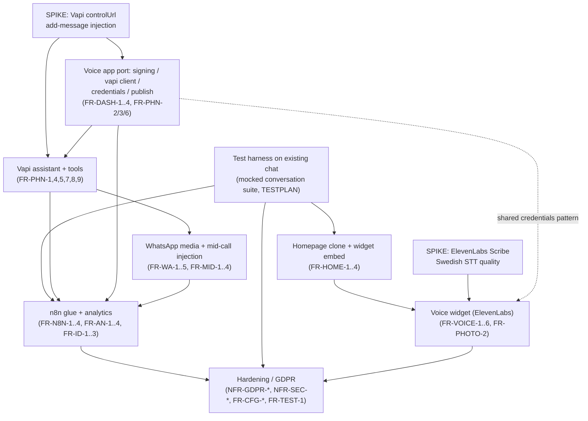

# Sprint Plan — Nordland VVS Support Bot Expansion

Date: 2026-07-12. Status: DRAFT for review. **Planning only — no source code changed by this document.**

Inputs (read in full before writing, all in `docs/plans/`):
`2026-07-12-audit-current-state.md` (AUDIT-CS), `2026-07-12-audit-budtender-voice-reuse.md` (AUDIT-VR),
`2026-07-12-srs-nordland-bot.md` (SRS, FR-x/NFR-x), `2026-07-12-design-telephony-vapi-whatsapp.md`
(DESIGN-TEL), `2026-07-12-design-homepage-widget-voice.md` (DESIGN-HW), `2026-07-12-test-plan-conversations.md`
(TESTPLAN, 46 scenarios / 12 golden).

Team: solo developer + AI coding agents. One sprint ≈ 1 week of that throughput. Bias: **ship a demoable
increment every sprint**, **de-risk the hardest unknowns early via timeboxed spikes**, **grow the test
suite alongside features** (TESTPLAN categories become CI-runnable as their backing feature lands; the
web-chat-only categories can run mocked starting Sprint 1 since `chat/orchestrator.py` already exists).

---

## 1. Milestone map

| Sprint | One-line demo statement |
|---|---|
| **S1** | Open the cloned Nordland homepage, chat with the embedded widget end-to-end, and watch the (already-existing) FSM behavior locked in by ~30 mocked conversation tests running green in CI. |
| **S2** | Two spikes proven or a documented fallback triggered: a live Vapi call gets a mid-call spoken injection via `controlUrl`, and ElevenLabs Scribe transcribes Swedish speech accurately. Dashboard has a working credentials page and a CLI provisioner that reconciles a test Vapi assistant with a verified zero-write no-op re-run. |
| **S3** | Toggle "Voice" in the live widget, speak a Tier-0 problem ("filter is dirty"), hear a synthesized Swedish reply — same lead/FSM outcome as typing it, provably. |
| **S4** | Dial the Nordland Vapi number, triage a call through the same KB (via server tools), and see a `ServiceRequest` lead land in the dashboard, `escalation_reason` correctly set. |
| **S5** | Mid-call, text a WhatsApp photo of a heat pump nameplate; within ~10s the live agent says "I can see your IVT Greenline HE, error E21…" without the caller prompting it. |
| **S6** | Dashboard analytics segment resolution/deflection by channel (web/voice/phone/WhatsApp) and by Tier 0–3; an n8n webhook fires on every completed lead; a customer who called last month is recognized when they chat on the web today. |
| **S7** | Full pre-ship gate green: 12 live golden scenarios pass, `purge_pii` covers every new model, fail-closed boot guards enforced, security review closed, GDPR sign-offs attached — ready to hand to the client. |

Total: **7 sprints (~7 weeks)**. See §7 for what's demoable to the client and when.

---

## 2. Dependency graph (major workstreams)

De-risking spikes (§4) sit at the top of the graph on purpose: both `D` (Vapi provisioning/webhooks)
and `C` (voice widget's STT choice) have a load-bearing external unknown that must be proven — or its
documented fallback triggered — before real feature work commits to an approach.

---

## 3. Per-sprint detail

Task-ID convention: `S<n>-T<n>`. Size: **S** = ≤0.5 day agent-effort, **M** = ~1 day, **L** = ~2 days.
Every task's Definition of Done names the concrete check (test file/command or manual verification) —
"looks right" is never sufficient per the user's verification-before-completion standard.

### Sprint 1 — Test harness + homepage clone (web chat baseline, locked)

**Goal:** Prove the existing FSM behavior with a real regression suite, and stand up the clone/demo
surface everything else builds on top of. No new backend capability — pure harness + presentation.

**Demo statement:** Load `https://.../demo/homepage`, the widget opens, completes a full session
(chat mode) against the real backend; `make test` shows ~25-30 new conversation tests green.

| ID | Description | FR/doc ref | Deps | Size | DoD (concrete verification) | TESTPLAN scenarios now CI-runnable |
|---|---|---|---|---|---|---|
| S1-T1 | Add `tests/support/convo.py::run_convo` helper (script→turn driver over `process_turn`, per-turn `expect` dict) | TESTPLAN §1.2 | — | M | `pytest tests/support/test_convo_helper.py` (new smoke test) passes; helper asserts state/decision/required/prohibited/slots/contact/chips | — (infra) |
| S1-T2 | Add `conversation_seed` fixture (runs `seed_kb`, asserts brand/machine/prompt rows exist) + classifier-phrase-integrity guard test (`kb/seed_prompts.py` phrases ⊆ `conftest._classify`) | TESTPLAN §5.2; AUDIT-CS gotcha 9; FR-CFG-2 | — | S | `pytest tests/test_classifier_integrity.py` passes; fails loudly if a prompt reword breaks the mock | — (infra) |
| S1-T3 | Implement Category A (autonomous resolve, 8 scenarios) as `tests/test_conversations_a.py` | TESTPLAN A1–A8 | S1-T1, S1-T2 | L | `pytest tests/test_conversations_a.py -q` → 8 passed; each scenario's mocked `answer_to_customer` authored from the cited `.txt` manual text | A1–A8 |
| S1-T4 | Implement Category B (troubleshoot→escalate, 6) incl. guardrail sub-assert in B3 | TESTPLAN B1–B6 | S1-T1, S1-T2 | L | `pytest tests/test_conversations_b.py -q` → 6 passed; B3 asserts `is_unsafe()` fires on a forced "re-pressurize" draft | B1–B6 |
| S1-T5 | Implement Category C (unsupported/info-gather, 5) | TESTPLAN C1–C5 | S1-T1, S1-T2 | M | `pytest tests/test_conversations_c.py -q` → 5 passed | C1–C5 |
| S1-T6 | Implement Category D (safety escalation, 5) incl. guardrail sub-asserts D2/D3 | TESTPLAN D1–D5 | S1-T1, S1-T2 | L | `pytest tests/test_conversations_d.py -q` → 5 passed; zero-tolerance: any prohibited-DIY substring found in any turn fails hard | D1–D5 |
| S1-T7 | Implement Category E (photo flows, E1–E3 only; E4 stubbed `@pytest.mark.skip(reason="phone+WA pending")` per checklist item 8) | TESTPLAN E1–E3, E4 stub | S1-T1, S1-T2 | M | `pytest tests/test_conversations_e.py -q` → 3 passed + 1 skipped with assertions already written | E1, E2, E3 |
| S1-T8 | Implement Category F (callback mechanics, 4) | TESTPLAN F1–F4 | S1-T1, S1-T2 | M | `pytest tests/test_conversations_f.py -q` → 4 passed (F2 both branches) | F1–F4 |
| S1-T9 | Implement Category G (conflict/difficult users, 5) | TESTPLAN G1–G5 | S1-T1, S1-T2 | M | `pytest tests/test_conversations_g.py -q` → 5 passed | G1–G5 |
| S1-T10 | Implement Category H (adversarial, 5) incl. `_LEAK`-clean assertion on every turn | TESTPLAN H1–H5 | S1-T1, S1-T2 | M | `pytest tests/test_conversations_h.py -q` → 5 passed | H1–H5 |
| S1-T11 | Implement Category I (edge/robustness, 4) | TESTPLAN I1–I4 | S1-T1, S1-T2 | M | `pytest tests/test_conversations_i.py -q` → 4 passed | I1–I4 |
| S1-T12 | Wire mocked catalog into CI as PR-blocking; add coverage-matrix test asserting every `states/guardrail/brand/escalation/channel` tag value appears ≥1× | TESTPLAN §5.1, §5.5 checklist item 5 | S1-T3..T11 | S | CI run on a throwaway PR shows the full conversation suite (~41 non-skipped scenarios) green, wall-clock < ~90s | full mocked catalog minus E4 |
| S1-T13 | New template `templates/homepage_demo.html` + view `core/views.py::homepage_demo` + URL, brand-blue (`#1a74bf`/`#0f4570`) + placeholder trade imagery, structure per DESIGN-HW §1.3 inventory (hero, regional-coverage, 3-up services, unique-solution block, water-test callout) | FR-HOME-3, FR-HOME-4; DESIGN-HW §1.1–1.3 | — | L | Manual check: page renders responsively (mobile+desktop) at `/demo/homepage`; no scraped `nordlandvvs.se` imagery present (provenance check per FR-HOME-4); "Demo" badge visible |
| S1-T14 | Embed existing widget script (same-origin ``, no `data-open`) | FR-HOME-1, FR-HOME-2; DESIGN-HW §1.4–1.5 | S1-T13 | S | AC-HOME-1/2/3: widget opens, completes a session, keyboard trap + Escape + reduced-motion + language switch all work identically to `widget_demo.html` — manual pass |
| S1-T15 | No `WIDGET_ALLOWED_ORIGINS` change needed for the same-origin case; document the cross-origin fallback path in `DEPLOY.md` | FR-HOME-2; DESIGN-HW §1.5 | S1-T14 | S | `DEPLOY.md` has a new "Homepage clone origin" subsection; if ever hosted cross-origin, the env var change is documented with an example |

**Sprint 1 total: ~15 tasks, roughly 6 L + 6 M + 3 S ≈ 5.5 effective days.** Fits one week with margin for the homepage's manual design pass.

---

### Sprint 2 — De-risking spikes + credentials/provisioning foundation

**Goal:** Resolve the two load-bearing unknowns before either voice workstream commits further, and
stand up the shared control-plane pieces (`voice/` app skeleton, `core/services/vapi.py`,
credentials page, zero-drift provisioner) that both the voice widget and the phone channel will read
from (`AgentPrompt`/`Credential` rows). No caller-facing feature ships yet.

**Demo statement:** In the dashboard, paste a Vapi test key and see it live-apply with no redeploy; run
`manage.py provision_vapi` twice and see the second run make zero Vapi writes; on a real (sandbox) Vapi
call, watch Django push a spoken confirmation via `controlUrl` mid-call.

| ID | Description | FR/doc ref | Deps | Size | DoD | TESTPLAN |
|---|---|---|---|---|---|---|
| S2-T1 | **SPIKE (timeboxed 1 day): Vapi Live Call Control.** Provision one throwaway Vapi assistant (Vapi UI or a minimal script), place a real/sandbox call, capture `monitor.controlUrl` from a `status-update` webhook payload, POST `add-message` mid-call, confirm the assistant speaks it | DESIGN-TEL §5.4–5.5; FR-MID-1/2 | — | L | Written spike report in `docs/plans/` (or an inline PR note) with: captured `controlUrl` JSON shape, latency measured push→speech, and a pass/fail verdict. **If it fails**: documented fallback is `check_photos` polling only (Option A becomes primary, not fallback) — record this decision explicitly, it changes S5's design. |
| S2-T2 | **SPIKE (timeboxed 1 day): ElevenLabs Scribe Swedish STT quality.** Record 5-10 short Swedish utterances (mix of clear speech + a technical term like "partikelfilter", "värmepump") through Scribe Realtime, measure WER informally, confirm token-mint/short-lived-token API exists as DESIGN-HW §4.1/§7.1 assumes | DESIGN-HW §2.1, §7.1; SRS FR-VOICE-2 | — | M | Spike note: WER estimate, confirmation the short-lived-token mint endpoint exists (or the fallback — proxy raw audio through Django, DESIGN-HW §7.1 — is adopted and flagged as added backend scope for S3) |
| S2-T3 | New `voice` Django app skeleton (`apps.py`, `urls.py`, `models.py` stub, registered in `INSTALLED_APPS`, `config/urls.py` include) | DESIGN-TEL §2–3; FR-PHN-2 | — | S | `python manage.py check` passes with the app installed; `voice/` importable, no circular imports with `chat`/`crm`/`kb` |
| S2-T4 | Port `voice/signing.py` (HMAC + shared-secret verify, fail-closed, constant-time compare) from `happytime-budtender/voice` | FR-PHN-3; AUDIT-VR §1; DESIGN-TEL §3.1, §8.1 | S2-T3 | S | Unit tests: unset secret → reject; valid HMAC → accept; valid shared-secret → accept; tampered body → reject. Lift-as-is per port table |
| S2-T5 | Port `core/services/vapi.py` (Bearer REST client, backoff, redaction, dry-run recorder) + add `get_call(call_id)` | FR-PHN-6; AUDIT-VR §2 | S2-T3 | M | Unit tests: dry-run mode (unset `VAPI_PRIVATE_KEY`) returns synthetic ids and records calls; a forced 429 triggers backoff+retry; secrets never appear in a raised `VapiError`'s string repr |
| S2-T6 | Port `voice/provision.py` + `voice/constants.py` (payload builders for a **single-tenant Nordland assistant**: Swedish voice/STT/LLM blocks per DESIGN-TEL §4.2, `TOOL_SPECS` placeholder) + zero-drift `sha256(canonical_json(redact_payload(payload)))` reconcile engine | FR-PHN-6; AUDIT-VR §2; DESIGN-TEL §3, §4 | S2-T5 | L | `pytest tests/test_provision.py`: (a) first `reconcile_all()` run creates the assistant (dry-run mode, asserts payload shape); (b) second run with no config change produces **zero** `VapiObject.last_provision_hash` mismatches / zero simulated writes (AC-PHN-6) |
| S2-T7 | `management/commands/provision_vapi.py` CLI wrapper | FR-PHN-6 | S2-T6 | S | `python manage.py provision_vapi --dry-run` runs clean against the dry-run recorder |
| S2-T8 | `dashboard/credentials.py` — declarative `CREDENTIAL_CATALOG`, `Credential` model + migration, `set_credential()` live-applies to `os.environ`/`settings`, `VoiceConfig.ready()` calls `apply_all()` at boot | FR-DASH-1, FR-DASH-2; AUDIT-VR §5; DESIGN-TEL §7 | S2-T3 | L | AC-DASH-1: setting a credential in the dashboard UI changes `settings.X` with no redeploy (manual check in `manage.py shell`); restart the dev server and confirm `apply_all()` re-asserts the DB value over `.env` |
| S2-T9 | `dashboard/publish.py` — extends Agent Config with voice/provider fields, "Publish to Vapi" button delegating to `provision.build_assistant_payload`, shows a payload diff before publish, `HHT_AUTO_PUBLISH`-equivalent defaults **OFF** | FR-DASH-3; AUDIT-VR §2 P6, Risks; DESIGN-TEL §7 item 2 | S2-T6, S2-T8 | M | AC-DASH-3: editing an `AgentPrompt` row and clicking Publish updates the (dry-run/sandbox) Vapi object; a no-edit re-save is a zero-write no-op (assert via `VapiObject.last_provision_hash` unchanged); auto-publish toggle defaults false in a migration/fixture check |
| S2-T10 | Fail-closed boot guard: `DEBUG=0` refuses to boot if `VAPI_PRIVATE_KEY`/`VAPI_WEBHOOK_SECRET` unset when phone channel enabled; `VOICE_WEBHOOK_DEV_BYPASS` flag honored only when `DEBUG=1` | FR-CFG-1; AUDIT-VR §6; DESIGN-TEL §8.1, §8.2 | S2-T3 | S | AC-CFG-1: a settings-check test with `DEBUG=0` and the phone channel flag on, secrets unset → raises `ImproperlyConfigured`; with `DEBUG=1` and `VOICE_WEBHOOK_DEV_BYPASS=1` → boots clean |

**Sprint 2 total: ~10 tasks, 2 L spikes + 3 L + 3 M + 2 S ≈ 6.5 effective days.** The two spikes are the
critical path — schedule them Monday/Tuesday so the rest of the sprint (and S3/S4's architecture) can
react to their verdicts.

---

### Sprint 3 — Widget voice mode (ElevenLabs, Option B)

**Goal:** Ship the recommended Option B voice architecture (DESIGN-HW §2.3–2.4): browser STT (Scribe,
per S2-T2's verdict) → the **existing, unmodified** `/api/chat` pipeline → ElevenLabs TTS proxy. Zero
orchestrator changes — this is the load-bearing property to verify, not assume.

**Demo statement:** Toggle Voice in the live widget, say "my IVT Vent 402 filter is dirty," hear a
Swedish TTS reply; the underlying `Session` row is bit-for-bit identical in shape to the typed
equivalent (AC-VOICE-1).

| ID | Description | FR/doc ref | Deps | Size | DoD | TESTPLAN |
|---|---|---|---|---|---|---|
| S3-T1 | Backend: `POST /api/chat/<public_id>/voice/stt-token` — mints short-lived Scribe token (or, if S2-T2's fallback triggered, a Django WebSocket audio-relay stub instead) | FR-VOICE-2; DESIGN-HW §4.1 | S2-T2 | M | Rate-limited via `_rate_ok` + new `RATE_LIMIT_VOICE_TOKEN`; a token response never contains `ELEVENLABS_API_KEY`; integration test hits the endpoint and asserts the response shape |
| S3-T2 | Backend: `POST /api/chat/<public_id>/voice/speak` — TTS proxy, streams `/v1/text-to-speech/{voice_id}/stream`, maps `Conversation.language`→voice_id, strips residual `wrap_untrusted` delimiters via existing sanitize utility | FR-VOICE-3; DESIGN-HW §4.2 | S2-T8 (voice_id credential) | M | Integration test: given a mock ElevenLabs response, the proxy streams `audio/mpeg` back; the ElevenLabs key never appears in the Django access/error log; ElevenLabs 4xx/429 degrades to a clean error, not a 500 |
| S3-T3 | Dashboard: extend §S2-T8 credentials catalog with `ELEVENLABS_API_KEY`, per-language `voice_id` fields, `voice_settings` JSON, global `VOICE_MODE_ENABLED` toggle | FR-DASH-4; DESIGN-HW §6 | S2-T8 | S | AC-VOICE-3: changing the voice id in the dashboard changes the synthesized voice on the next `/voice/speak` call, no redeploy (manual check) |
| S3-T4 | Widget JS: mode toggle (`Chat \| Voice`), 4 UI states (Idle/Listening/Thinking/Speaking) + Error sub-state, mic permission on first-tap-only, tap-to-talk + ~1.2s silence auto-stop | FR-VOICE-1, FR-VOICE-5; DESIGN-HW §3.1–3.4 | S3-T1 | L | Manual pass across Chrome/Safari/Firefox desktop + mobile (per DESIGN-HW §8.2 browser matrix): all 4 states render correctly; mic prompt only fires on first Voice tap |
| S3-T5 | Widget JS: barge-in (stop TTS playback + cancel in-flight fetch on new mic activity or explicit tap) | FR-VOICE-1; DESIGN-HW §3.3 | S3-T4 | M | Manual pass: tapping mic mid-TTS-playback stops audio within ~200ms and returns to Listening; no orphaned audio elements accumulate over 10 turns |
| S3-T6 | Widget JS: transcript visibility (voice turns append to the same scrolling bubble transcript as chat), chip read-aloud (spoken enumeration appended to TTS text when chips are present), fallback-to-chat on any failure (mic denied / STT fails / TTS fails / unsupported browser) | FR-VOICE-1, FR-VOICE-5, FR-PHOTO-2; DESIGN-HW §3.5–3.7, §9.1 | S3-T4 | M | AC-VOICE-5: denying mic permission falls back to Chat mode with a visible notice, conversation/session unaffected (assert `public_id` unchanged, transcript intact) — manual + one widget unit test if a JS test harness exists, else a documented manual QA script |
| S3-T7 | Photo upload in voice mode: reuse the coupled `/message` multipart endpoint from the voice UI's camera/attach button (per DESIGN-HW §5.2's "no new endpoint for v1" decision); speak the SSE `notice` frame on rejection via `/voice/speak` | FR-PHOTO-2; DESIGN-HW §5 | S3-T2, S3-T4 | M | AC-PHOTO-2: a photo uploaded in voice mode produces identical `_run_vision`/`CaseState.slots` output to the same image uploaded in chat mode (assert against S1-T7's E1/E3 fixtures reused with a voice-mode driver); a rejected image is both shown as text AND spoken |
| S3-T8 | Safety gate before TTS: assert `guardrails.is_unsafe()` already runs inside `process_turn()` (it does, per AUDIT-CS §1) — this task is verification-only, confirming voice mode never speaks a draft that bypassed the gate | FR-VOICE-6; SRS §2.3 S-8 | S3-T2 | S | AC-VOICE-6: a scripted refrigerant-work request in voice mode produces the escalation message via TTS, never a DIY step — automated test driving the voice endpoints against a forced-unsafe mocked specialist draft |
| S3-T9 | Latency measurement harness: instrument `/voice/speak` + the STT round-trip to log stage timings; compare against NFR-LAT-2's ≤2.5s target | NFR-LAT-2; DESIGN-HW §8.1 | S3-T1, S3-T2 | S | AC-VOICE-4: 10 measured Tier-0 turns logged with per-stage timing; **expected outcome given DESIGN-HW §8.1's own estimate (~2-5s typical) is that the target is NOT met** — see Cross-doc Conflicts §8; if unmet, record the FR-VOICE-4b fallback decision (accept-as-is vs. spike `generate_stream()`) explicitly rather than silently shipping past the NFR |
| S3-T10 | Extend TESTPLAN E4 stub + add voice-mode re-runs of A1/B1/C1/D1/F1/G2 per TESTPLAN §3.2's chip→verbal-enumeration and spoken yes/no assertions, **scoped to web-voice only** (see Cross-doc Conflicts §8 — phone/Vapi does not share this mechanism) | TESTPLAN §3.2, §3.5 (channel matrix) | S1-T3..T11, S3-T4..T7 | L | New `tests/test_conversations_voice.py`: re-run A1, B1, C1, D1, F1, G2 through a voice-mode driver (transcript in → same `/message` call → assert TTS-text matches chip-enumeration pattern); all 6 pass |

**Sprint 3 total: ~10 tasks, 2 L + 5 M + 3 S ≈ 6 effective days.**

---

### Sprint 4 — Vapi assistant + tools (phone channel MVP)

**Goal:** Inbound calls work end-to-end through Vapi's own LLM + Django server tools (NOT the chat FSM
— see DESIGN-TEL §6). Ship the mandatory floor (async lead + callback offer); warm transfer is
deferred (owner decision needed, §5 risk register).

**Demo statement:** Call the provisioned Vapi number, describe a problem, the assistant looks up the KB
via a tool, and a `ServiceRequest` with correct `escalation_reason` appears in the dashboard's new call
monitor.

| ID | Description | FR/doc ref | Deps | Size | DoD | TESTPLAN |
|---|---|---|---|---|---|---|
| S4-T1 | `voice/webhooks.py` — `vapi_webhook` view, signature-first (S2-T4), dispatch table for `tool-calls`/`status-update`/`end-of-call-report`; `status-update` captures `monitor.controlUrl` onto `VoiceCall` | FR-PHN-1..4, FR-PHN-7; AUDIT-VR §1; DESIGN-TEL §3.1 | S2-T3, S2-T4 | L | AC-PHN-3: missing/invalid signature → 401 before body parse; valid signature → dispatches; a duplicate `end-of-call-report` for the same `call_id` creates exactly one `VoiceCall` row (AC-PHN-7) |
| S4-T2 | `voice/models.py` — `VoiceCall`/`VoiceTurn`/`VoiceToolCall`/`VapiObject` (adapted from AUDIT-VR §4 shapes) + migration | FR-PHN-7; AUDIT-VR §4 | S2-T3 | M | Migration applies clean; `unique_together` constraints match the audit's frozen shapes (`(call, seq)` on turns, `(call_id, tool_call_id, name)` on tool calls) |
| S4-T3 | `voice/tools/__init__.py` — registry + `dispatch()` + central `guardrails.scrub_leak` + arg-schema wall (`_sanitize_args` driven by `constants.TOOL_SPECS`) | FR-PHN-4; AUDIT-VR §3 | S4-T2 | M | Unit tests: unknown tool → `{"error":"unknown_tool"}`; a handler exception → `{"error":"tool_failed"}`, never raises to the caller; scrub applied to every registered handler's result |
| S4-T4 | `voice/tools/identify.py::identify_machine` tool (wraps `kb.identification.identify_machine`) | DESIGN-TEL §4.3 table | S4-T3 | S | Tool test: known brand+model → `{"identified": true, ...}`; unknown → `{"identified": false}`, never fabricates a model |
| S4-T5 | `voice/tools/kb.py::kb_lookup` tool (wraps `chat/context.collect_knowledge` + a specialist-style Gemini call, mirrors `CONFIDENCE_GATE=0.70`) | DESIGN-TEL §4.3 table; FR-PHN-4 | S4-T3 | L | Tool test: in-docs high-confidence case → `{"can_help": true, "answer": "..."}`; low-confidence/timeout → `{"can_help": false, "suggest_escalate": true}`; `timeoutSeconds` set per DESIGN-TEL's 20s budget |
| S4-T6 | `voice/tools/lead.py::create_lead` + `schedule_callback` (wrap `crm.leads.create_and_dispatch`, idempotent by `ServiceRequest.idempotency_key`) | FR-ESC-3; DESIGN-TEL §4.3 table | S4-T3 | M | Tool test: two calls with the same idempotency inputs return the same lead id, no duplicate `ServiceRequest` (AC-N8N-3-adjacent idempotency pattern) |
| S4-T7 | System prompt derivation: compose the voice system prompt from the existing `specialist` `AgentPrompt` body + a new short `voice_preamble` (Option B per DESIGN-TEL §4.1) | FR-PHN-6; DESIGN-TEL §4.1 | S2-T6 | M | `provision.build_assistant_payload("voice")` output contains the specialist persona/scope/guardrail text plus the preamble; no bespoke duplicate persona written from scratch |
| S4-T8 | Provision the real Nordland assistant (Swedish 11labs voice, Deepgram `sv` transcriber, Gemini 2.5 Flash) + phone-number attach, via `provision_vapi` | FR-PHN-6; DESIGN-TEL §4.2 | S4-T4..T7, S2-T7 | M | `python manage.py provision_vapi` against a real (sandbox) Vapi account creates the assistant + attaches the phone number; a live test call connects and the assistant speaks in the persona |
| S4-T9 | Channel-aware turn/session model: **no** `CaseState`/`MAX_TOTAL_TURNS` reuse for phone (per DESIGN-TEL §6 — voice state lives in the Vapi conversation + tool-call log, not the FSM); confirm this explicitly rather than half-porting the ceilings | FR-PHN-9 (as applied to phone); DESIGN-TEL §6 | S4-T1 | S | Code review checkpoint: no phone-channel code path constructs a `chat.Conversation`/`CaseState` per call; documented in a short ADR-style comment in `voice/webhooks.py`. See Cross-doc Conflicts §8 — this task exists specifically to resolve the SRS/DESIGN-TEL tension found there |
| S4-T10 | `dashboard/` — call monitor/log page (list, transcript, tool-call audit) + `callfetch.py` on-demand `GET /call/{id}` reconciliation button | FR-DASH-5; AUDIT-VR §4 | S4-T2, S2-T5 | M | AC-DASH-5: a completed test call shows transcript + tool-call log in the dashboard; "fetch full conversation" button pulls and displays Vapi's authoritative record |
| S4-T11 | Extend `crm/sinks.py`'s escalation path so phone-originated leads land in the same `Session`/`ServiceRequest`/`LeadDelivery` tables as web leads (per DESIGN-TEL §6) | FR-ESC-3, FR-ESC-4; DESIGN-TEL §6 | S4-T6 | S | A phone-originated `create_lead` tool call produces a `Session`/`ServiceRequest` row indistinguishable in shape from a web-originated one (same columns populated), stamped with `phone_hash` |
| S4-T12 | Phone-channel conversation tests: adapt B1/C1/D1 flows to a tool-call-driven test harness (NOT `run_convo` — a new `run_call` driving `voice.tools.dispatch` directly, since phone doesn't use `process_turn`) | TESTPLAN §3.2 (phone-specific subset); AC-PHN-4 | S4-T4..T6 | L | AC-PHN-4: a simulated "unsupported brand" tool sequence escalates with `escalation_reason == "unsupported"`, matching the web equivalent's outcome shape (not code path) |

**Sprint 4 total: ~12 tasks, 3 L + 6 M + 3 S ≈ 7 effective days.** Slightly over a nominal week — if S2's
spike verdicts add scope (e.g. the controlUrl fallback), trim S4-T10 (call monitor) to a stub list view
and finish it in S5.

---

### Sprint 5 — WhatsApp media ingestion + mid-call photo injection (headline feature)

**Goal:** The feature the owner explicitly called out as the hardest/most novel: a WhatsApp photo sent
during a live call becomes a spoken confirmation within the call, using the mechanism S2-T1's spike
proved (or its fallback).

**Demo statement:** Mid-call, the caller texts 2 photos to a WhatsApp number the agent gave them; ≤~10s
later (typical, per DESIGN-TEL §5.6) the agent says "I received 2 photos — IVT Greenline HE, error
E21…" without being asked.

| ID | Description | FR/doc ref | Deps | Size | DoD | TESTPLAN |
|---|---|---|---|---|---|---|
| S5-T1 | Refactor `_run_vision`'s vision-call body out of `chat/orchestrator.py` into `chat/vision.py::extract_nameplate(image_path) -> dict` — one implementation, two callers (orchestrator + WhatsApp) | FR-PHOTO-3; AUDIT-CS gotcha 5; DESIGN-TEL §5.2 | — | M | Existing orchestrator tests (`test_orchestrator.py`, TESTPLAN E1/E3) still pass unchanged after the extraction — pure refactor, zero behavior change, verified by full existing suite green |
| S5-T2 | `voice/whatsapp.py` — Meta Cloud API webhook receiver: GET handshake (`hub.challenge`), POST with `X-Hub-Signature-256` fail-closed verify, message-type dispatch (image/document → `enqueue_media`) | FR-WA-1, FR-WA-2; DESIGN-TEL §3.1, §8.1 | S2-T4 | M | Unit tests: bad/missing signature → reject; valid signature + image message → enqueues; GET handshake echoes `hub.challenge` only when `hub.verify_token` matches |
| S5-T3 | `fetch_and_ingest(media_id, from_phone)` — two-hop Graph API fetch (`GET /{media_id}` → temp URL → `GET url`), reuses `sanitize_image()` verbatim, calls `chat.vision.extract_nameplate` (S5-T1) | FR-WA-3, FR-PHOTO-3; DESIGN-TEL §5.2 | S5-T1, S5-T2 | L | AC-WA-3: a mocked Meta media response flows through fetch → sanitize → vision → stored facts; raw temp-URL bytes never persisted, only the re-encoded JPEG (assert no other file artifact exists) |
| S5-T4 | `voice/models.py::PhotoContext` (phone_hash-keyed, facts JSON, image_sha256, call_id, control_url, delivered flag) + migration; `voice/photostore.py` (`upsert`/`latest_for`/`bind_call`/`maybe_push_to_live_call`) | FR-MID-2, FR-MID-4; DESIGN-TEL §5.3 | S4-T2 | M | Unit tests: `upsert` is idempotent by `image_sha256`; `latest_for` respects `max_age_s`; `bind_call` correctly attaches a pending `control_url` |
| S5-T5 | `voice/callcontrol.py` — `say()`/`add_message()` POST to `controlUrl`, per S2-T1's verified contract | FR-MID-2; DESIGN-TEL §3.1, §5.4 | S2-T1 (spike verdict) | S | If spike passed: unit test against a mocked `controlUrl` endpoint confirms the exact request shape (`{"type":"add-message","message":{"role":"system","content":...},"triggerResponseEnabled":true}`). **If spike failed**: this task is replaced by hardening `check_photos` polling only — record which branch was taken |
| S5-T6 | `voice/tools/photos.py::request_photos` + `check_photos` tools; `request_photos` sends the Meta template + stamps a `PhotoContext` placeholder with `call_id`/`control_url` from `ctx` | FR-MID-1, FR-MID-3; DESIGN-TEL §4.3 table | S5-T4, S4-T3 | M | Tool tests: `request_photos` degrades to `{"sent": false, "fallback": "..."}` on a Meta send failure without raising; `check_photos` returns `{"received": 0}` when nothing has arrived yet |
| S5-T7 | Wire the confirmation utterance: on `PhotoContext` update with facts ready, call `maybe_push_to_live_call` → `callcontrol.add_message` with the structured `[PHOTO_CONTEXT]` note (DESIGN-TEL §5.7's exact contract, including "do not read serial aloud") | FR-MID-1, FR-MID-2; DESIGN-TEL §5.7 | S5-T3, S5-T5, S5-T6 | M | E2E test (mocked Meta + mocked Vapi controlUrl): simulate the full sequence diagram (DESIGN-TEL §5.5); assert the injected content matches the structured-note template with correct `{n, brand, model, error_code}` substitution |
| S5-T8 | Return-fast + `threading.Thread` pattern for the WhatsApp handler (per-thread Gemini client construction — audit's caveat); no Celery/Redis | NFR-AVAIL-2 (WSGI constraint); DESIGN-TEL §9 | S5-T2, S5-T3 | M | Load-style manual test: Meta webhook view returns `200` in <500ms even while the vision/push work continues in-thread; a forced Gemini exception inside the thread doesn't crash the request or the process |
| S5-T9 | Same-number vs. different-number join: default same-number `phone_hash` match; document the pairing-code fallback as a **phase-2, not built this sprint** (per DESIGN-TEL §6 edge case, open Q6) | FR-MID-4; DESIGN-TEL §6 | S5-T4 | S | Explicit note in `voice/photostore.py` docstring + this sprint plan's out-of-scope list (§6) recording the deferral; no code for the pairing-code path this sprint |
| S5-T10 | Implement TESTPLAN E4 (WhatsApp photo during a phone call) as a real (unskipped) test against the S5 pipeline, replacing the S1-T7 stub | TESTPLAN E4; TESTPLAN §3.3 confirmation-loop contract | S5-T7 | M | `pytest tests/test_conversations_e.py::test_e4` passes: confirmation turn restates `{model}`/`{error_code}` AND asks a yes/no confirmation question; `CaseState` does not apply here (phone doesn't use it) — assert against the tool-call-log driver from S4-T12 instead, confirming no orchestrator coupling |
| S5-T11 | Latency budget verification against NFR-LAT-4 (≤~10s typical, photo received → live-call lookup) | NFR-LAT-4; DESIGN-TEL §5.6 | S5-T7 | S | 10 measured runs (mocked network delays at DESIGN-TEL §5.6's stage estimates) logged; median within budget, worst-case documented (design's own table already flags ~17.6s worst-case — record as accepted risk, not a silent gap) |

**Sprint 5 total: ~11 tasks, 2 L + 6 M + 3 S ≈ 6.5 effective days.**

---

### Sprint 6 — n8n glue, cross-channel identity, analytics

**Goal:** Close the loop across channels — the same customer is recognized whether they called, texted,
or chatted; every completed interaction can optionally fan out to n8n; analytics segment by channel and
by tier so the "triage nurse" deflection target (§SRS 1.2) is measurable.

**Demo statement:** Look up a customer by phone in the dashboard and see their web session, phone call,
and WhatsApp photo all under one `Customer` record; watch an n8n test webhook fire on a new lead;
Analytics shows a Tier 0–3 breakdown and per-channel deflection rate.

| ID | Description | FR/doc ref | Deps | Size | DoD | TESTPLAN |
|---|---|---|---|---|---|---|
| S6-T1 | `crm/sinks.py::N8nSink` — extend the existing `SINKS` list (don't fork), fires on `end-of-call-report` and on `create_and_dispatch`, PII-masked payload, degrades to no-op when `N8N_WEBHOOK_URL` blank | FR-N8N-2, FR-N8N-3; AUDIT-VR §3, §4 | S2-T8 (credential) | M | AC-N8N-1: a completed lead with `N8N_WEBHOOK_URL` set fires a masked payload (assert no raw phone number in the POST body, only `phone_hash`-derived data); blank URL → `LeadDelivery` status `skipped`, no HTTP call attempted |
| S6-T2 | `voice/tools/n8n.py::notify_n8n` — bot-callable tool, distinct direction from S6-T1's automatic sink (per FR-N8N-1's "two independent directions" requirement) | FR-N8N-1; AUDIT-VR §3 | S4-T3 | S | AC-N8N-2/3: the automatic sink and the bot-callable tool are independently testable and independently toggleable; a retried tool call carries the same idempotency-relevant fields and does not double-post distinct real-world side effects |
| S6-T3 | `dashboard/` — n8n settings page (URL field + enable toggle) | FR-N8N-4; DESIGN-TEL §7 item 5 | S2-T8 | S | Setting `N8N_WEBHOOK_URL` from the dashboard live-applies with no redeploy (reuses S2-T8's mechanism, thin wrapper) |
| S6-T4 | Extend `Customer`/returning-customer detection so a phone caller or WhatsApp sender resolves to the same `Customer` via `phone_hash` (`crm/profile.py::enrich_customer_from_session` extended to phone/WA-originated `Session` rows) | FR-ID-1, FR-ID-3; DESIGN-TEL §6 | S4-T11, S5-T4 | M | AC-ID-1/3: a caller whose number matches a prior web `Customer.phone_hash` is recognized (no duplicate `Customer` created), and `equipment_summary`/prior session history is available to the phone-channel `kb_lookup`/`create_lead` tools |
| S6-T5 | Analytics: extend `crm/analytics.py` with a channel dimension (web chat / web voice / phone / WhatsApp) across `kpis()`/`breakdowns()`/`trend()` | FR-AN-2 | S4-T11, S3-T2 (channel taggable on Session) | M | `crm.analytics.breakdowns()` output includes a `by_channel` key with resolution/deflection/escalation/returning rates per channel; a unit test seeds one Session per channel and asserts correct bucketing |
| S6-T6 | Analytics: phone-specific metrics (call duration, transfer disposition, callback offered/accepted, mid-call photo received) from `VoiceCall`/`PhotoContext` | FR-AN-3 | S4-T2, S5-T4 | M | `crm.analytics.phone_stats()` (new function) returns the 4 metrics above over a seeded set of `VoiceCall` rows; unit-tested |
| S6-T7 | Analytics: Tier 0–3 breakdown (per SRS §2.1's four tiers, derived from existing `Session.decision`/`escalation_reason`/`state` columns — no new column needed, a classification function over existing data) | FR-AN-4; SRS §2.1 | — | M | `crm.analytics.tier_breakdown()` classifies a seeded mix of Sessions into Tier 0 (resolved, no lead)/Tier 1 (escalate after specialist attempt)/Tier 2 (`unsupported`)/Tier 3 (safety `escalation_reason`) and returns correct counts; unit-tested against fixtures mirroring TESTPLAN's A/B/C/D categories |
| S6-T8 | Dashboard: channels/integration status view (Vapi reachability probe via `auth_ok()`, n8n URL set, WhatsApp token set, ElevenLabs key set) | FR-DASH-6 | S2-T5, S2-T8 | S | Manual check: the status page correctly flags an unset `WA_APP_SECRET` as "not configured" and a set `VAPI_PRIVATE_KEY` with a live probe result as "reachable" |
| S6-T9 | Guardrail-cannot-be-deleted-from-UI assertion: code-level test that no dashboard flow/graph edit can remove a safety-critical transition, applied to the new voice/publish surfaces added in S2/S4 | FR-DASH-8; AUDIT-VR §7 | S2-T9, S4-T7 | S | AC-DASH-8: a test attempting to publish an assistant payload with the guardrail block stripped from the composed prompt fails/is rejected by `build_assistant_payload`'s composition logic (the guardrail text is appended in code, not editable away) |

**Sprint 6 total: ~9 tasks, 5 M + 4 S ≈ 5 effective days.** Lighter sprint — buffer for S4/S5 spillover if
the WhatsApp/mid-call work ran long.

---

### Sprint 7 — Hardening, GDPR, pre-ship gate

**Goal:** Everything built in S1–S6 passes the full pre-ship gate (SRS §7 acceptance criteria +
TESTPLAN Part 5's release-blocker rules): live golden set green, `purge_pii` extended, security review
closed, GDPR sign-offs attached as explicit records (not silent assumptions).

**Demo statement:** Run the full release checklist live — 12 golden scenarios pass against real Vertex,
`purge_pii --dry-run` correctly enumerates every new model type, and a signed-off GDPR decision doc
exists for ElevenLabs/Vapi/WhatsApp data residency.

| ID | Description | FR/doc ref | Deps | Size | DoD | TESTPLAN |
|---|---|---|---|---|---|---|
| S7-T1 | Add the 12 live golden scenario twins (`@pytest.mark.live`) with LLM-judge rubrics | TESTPLAN §1.4, §1.5, FR-TEST-1 | S1-T3..T11, S5-T10 | L | `pytest -m live tests/test_golden_live.py` passes all 12 against real Vertex; judge JSON+evidence archived per run; flake policy (re-run 3×, ≥2/3 fail = real regression) implemented |
| S7-T2 | Extend `purge_pii.py` to cover `VoiceCall`/`VoiceTurn`/`VoiceToolCall`/`PhotoContext` (cascade + best-effort file delete for linked `CustomerFile`) | NFR-GDPR-1, NFR-GDPR-4; DESIGN-TEL §8.4 | S4-T2, S5-T4 | M | AC-GDPR-1/4: `purge_pii --days N --dry-run` reports correct counts for the new models past cutoff; `--yes` deletes them and cascades correctly; existing `Conversation`/`Customer` purge behavior unchanged (regression check against `test_crm_retention.py`) |
| S7-T3 | Security pass: confirm every new webhook (`voice/webhooks.py`, `voice/whatsapp.py`) verifies signature before body parse (view-level, not middleware, per DESIGN-TEL §8.1's Vapi-retry note); confirm `NFR-SEC-6` (no secret in source/client JS) | NFR-SEC-1, NFR-SEC-6, NFR-SEC-7 | S4-T1, S5-T2 | M | Manual + automated: grep for any hardcoded key pattern in `voice/`/`chat/voice.py`/widget JS returns none; both webhook views return 401 before touching `request.body` json-parse on a bad signature (confirmed via a test that raises inside the parse step if reached prematurely) |
| S7-T4 | Turn-ceiling review for **web voice** specifically (phone is out of scope per S4-T9's resolution): confirm `MAX_TOTAL_TURNS`/`REPLY_BUDGET` are env-overridable and a voice-mode-aware profile doesn't truncate mid-sentence | FR-PHN-9 (as clarified — applies to web voice, not phone); NFR-AVAIL-3 | S3-T4..T7 | S | AC-PHN-9 (reframed to web voice): a scripted long voice conversation exceeding the default 25-turn ceiling with a raised env override does not truncate; without the override, truncation is graceful (an explicit wrap-up message, not a silent cutoff) |
| S7-T5 | GDPR decision record: consolidate the open questions (§5 below) into a single signed decision doc — data residency (ElevenLabs/Vapi/Deepgram/Meta), call recording retention, WhatsApp BSP choice | NFR-GDPR-2; DESIGN-TEL §11 Q1/Q2/Q3; DESIGN-HW §9.2 Q3/Q4 | — (owner decisions, not code) | M | A dated decision doc exists under `docs/plans/` or `docs/decisions/` with the owner's explicit answers to Q1–Q3 below; code changes (if any, e.g. disabling call recording) are cross-referenced to it |
| S7-T6 | `AGENT_ROLE_CHOICES` + conftest classifier audit for every new role added across S2–S6 (`voice`, `voice_preamble`) — confirm S1-T2's guard test catches all of them | FR-CFG-2 | S4-T7 | S | `pytest tests/test_classifier_integrity.py` (from S1-T2) still passes with the new roles added; a deliberately-broken phrase match fails the test (negative-path check) |
| S7-T7 | Full-catalog live smoke (weekly release-candidate run, not just the 12 golden) wired into CI as a scheduled job | TESTPLAN §5.1 | S7-T1 | S | A CI schedule (cron) config exists and one manual trigger completes successfully against a release-candidate branch |
| S7-T8 | Cron/ops closure: configure `resend_leads`/`purge_pii`/`summarize_idle` as actual scheduled jobs (currently documented but unconfigured per AUDIT-CS §9) | NFR-DEP-1 | S7-T2 | S | A crontab/systemd-timer/deploy-platform-native schedule exists on the VPS for all three commands; a manual dry run of each confirms it executes without error in the prod-like environment |
| S7-T9 | Final pre-ship gate run: all SRS §7 acceptance criteria (AC-HOME through AC-GDPR) checked off against the live system | SRS §7 (all AC-*) | everything above | L | A single checklist artifact (dashboard doc or PR description) enumerates every AC-* from SRS §7 with a pass/fail + evidence link; zero fails on safety-critical criteria (AC-VOICE-6, AC-PHN-3, AC-WA-2/3, AC-MID-1/2, AC-DASH-8) is a hard gate — release does not proceed otherwise |

**Sprint 7 total: ~9 tasks, 2 L + 5 M + 2 S ≈ 5 effective days.**

---

## 4. Sequencing rationale

**Why test harness first (S1), before any new feature.** The existing FSM is the frozen baseline every
new channel must preserve (SRS §1.4, §4.0). Writing ~41 mocked conversation tests against it in Sprint 1
means every subsequent sprint has a regression tripwire for free — a voice-mode or phone-channel change
that accidentally alters orchestrator behavior fails loudly instead of being discovered live. This is
cheap now (the pipeline already exists, per the brief) and expensive to retrofit later.

**Why the homepage clone rides along in S1, not later.** It has zero dependency on any new backend
capability (DESIGN-HW §1.1: same-origin embed of the unmodified widget), so it costs nothing to ship
early and becomes the client demo surface for every subsequent sprint's incremental capability. Shipping
it standalone in S1 rather than bundling it with S3's voice work also means the client sees visible
progress in week one.

**Why the spikes are explicitly Sprint 2, not folded into feature sprints.** Two designs (DESIGN-TEL
§5.4, DESIGN-HW §2.1/§7.1) each hinge on an unverified external capability:
1. **Vapi `controlUrl` mid-call injection** (S2-T1) — DESIGN-TEL's entire mid-call photo architecture
   (Option B, the chosen primary mechanism) depends on this working as documented. If it fails, the
   fallback is **`check_photos` polling as primary**, not a minor tweak — it changes S5's UX contract
   (proactive push → reactive poll) and should be known before S4 provisions the real assistant's tool
   set, not discovered mid-S5.
2. **ElevenLabs Scribe Swedish STT quality** (S2-T2) — DESIGN-HW's Option B (the recommended voice
   architecture) is chosen specifically because Scribe's Swedish accuracy is verified-good per
   ElevenLabs' own docs; if a live spike disagrees, the fallback is the Web Speech API (weaker, but
   zero-infra) or reconsidering Option A (ElevenLabs Agents Platform) — a materially different S3
   architecture. Either fallback needs to be known before S3's UI work commits to a specific token/
   session shape.

Running both spikes in the same week they're needed (not earlier as a standalone "spike sprint 0," not
later as a mid-feature surprise) keeps the plan honest about risk without wasting a whole sprint on
spikes alone — S2 also ships real, always-useful infrastructure (credentials, provisioner, signing)
that doesn't depend on either spike's outcome.

**Why voice widget (S3) before phone (S4), even though phone is the "headline" ask.** S3 reuses
`process_turn()` completely unmodified (DESIGN-HW's load-bearing property) — it is lower-risk, faster
to ship, and immediately demoable on the existing web surface with no new external account
provisioning beyond one ElevenLabs key. S4 requires a live Vapi account, phone number, and squad
provisioning — more external dependency, more setup lead time (a phone number takes days to provision
in some cases) — so starting that provisioning process during S2's spike (which already touches Vapi)
and building the assistant in S4 keeps the phone number's setup lead time off the sprint's critical
path.

**Why WhatsApp + mid-call injection (S5) is its own sprint, not folded into S4.** It is explicitly
flagged in both audits and the SRS as "the largest net-new piece... has no precedent to copy wholesale"
(AUDIT-VR Gaps §2, SRS FR-MID-2). Isolating it protects S4's simpler "phone triage + lead" MVP from
being blocked by the hardest problem in the whole project. If S5 runs over, S4's deliverable is still a
complete, demoable phone channel on its own.

**Why n8n/analytics/identity (S6) comes after both channels exist, not interleaved.** Cross-channel
identity (FR-ID) and channel-segmented analytics (FR-AN-2) are meaningless until there are ≥2 non-web
channels producing data to join and segment. Building S6 earlier would mean testing against fixtures
only, deferring real validation to the same point anyway.

**Why hardening/GDPR is last (S7), not spread throughout.** Some of it genuinely can't happen earlier —
the live golden set (S7-T1) needs every channel's mocked twin already passing (S1, S3-T10, S5-T10) and
GDPR decision-recording (S7-T5) is deliberately positioned as a **gate before general availability**,
not before internal demos, since the SRS treats non-EU processing acceptance as a go-live blocker
(SRS NFR-GDPR-2), not a build blocker. Security/purge_pii extension work is deferred to S7 specifically
because it needs every new model (`VoiceCall`, `PhotoContext`, etc.) to already exist, which only
happens by end of S5.

---

## 5. Risk register

Top 10 risks, drawn from the SRS's "Open items" (§SRS end), DESIGN-TEL §11, and DESIGN-HW §9.2.

| # | Risk | Likelihood | Impact | Mitigation | Owner decision needed |
|---|---|---|---|---|---|
| R1 | **GDPR/data residency** — Vapi, ElevenLabs, Deepgram, Meta are US-centric; Gemini stack is EU-pinned. Shipping without an explicit decision risks a compliance gap discovered post-launch | Med | **High** (legal/compliance exposure) | S7-T5 consolidates a signed decision doc before go-live; NFR-GDPR-2 explicitly forbids assuming compliance | **By S2** (informs whether EU-region Vapi/BSP alternatives must be sourced instead — changes S4 provisioning) |
| R2 | **Vapi `controlUrl` injection doesn't work as documented** — the entire mid-call photo UX (the headline feature) depends on it | Low-Med (docs are explicit and recently verified, but unverified live) | **High** (redesigns S5's UX to reactive-only) | S2-T1 spike, timeboxed, documented fallback (`check_photos` becomes primary) | **By S2** |
| R3 | **ElevenLabs Scribe Swedish accuracy disappoints in practice** vs. documented benchmarks | Low | Med (S3's core value prop degrades; fallback exists) | S2-T2 spike; B2 (Web Speech API) or Option A fallback documented | **By S2** |
| R4 | **Voice latency NFR (≤2.5s) is unachievable** — the design doc's own estimate is 2-5s typical, dominated by the existing non-streaming FSM turn | **High** (near-certain per the design's own numbers — see Cross-doc Conflicts §8) | Med (UX disappointment, not a blocker — chat-mode already has this latency) | S3-T9 measures and records; FR-VOICE-4b's `generate_stream()` wiring is the sanctioned but out-of-default-scope fix | **By S3** — accept 2-5s as shipped v1, or greenlight the FSM streaming refactor as a post-S7 follow-on |
| R5 | **WhatsApp provisioning friction** — Meta Business verification + template approval for `request_photos` can take days to weeks, outside engineering control | Med | Med (blocks S5's live demo, not the code) | Start Meta Business verification + template submission in **S2**, in parallel with the Vapi spike, so approval lands before S5 needs it | **By S2** (which WhatsApp number, Cloud API direct vs. BSP — DESIGN-TEL §11 Q3) |
| R6 | **Warm transfer scope creep** — SRS makes it optional (FR-PHN-5 floor is async lead + callback), but "the phone channel should obviously transfer to a human" is an easy scope-creep request mid-project | Med | Med (schedule risk if added ad hoc) | Explicitly out-of-scope for S4 (§6 below); revisit only as a scoped follow-on sprint if requested | **By S4** — confirm callback-only is acceptable for v1 |
| R7 | **Auto-publish-on-save surprises an operator** by pushing an untested prompt change straight to the live Vapi assistant | Low (defaults OFF per S2-T9) | Med if enabled carelessly later | Default OFF enforced by S2-T9's DoD; a staging assistant id recommended before ever enabling it | **Deferred** — no action needed unless the owner requests auto-publish later |
| R8 | **Cross-doc test-plan/design conflation of web-voice and phone/Vapi mechanics** (see Cross-doc Conflicts §8) causes a wasted sprint building spoken-chip/`_is_yes` logic for a channel that doesn't use it | Med (real ambiguity found in TESTPLAN §3.2) | Med (wasted S3/S4 effort if not caught) | S3-T10 and S4-T9 explicitly scope this split; flagged here and in §8 so it's caught at planning time, not mid-sprint | **Resolved in this plan** — no further owner input needed, but worth a one-line confirmation |
| R9 | **`nordland.sql` / loose `.txt` content not loaded** — Tier-0 deflection target may not be reachable in production if Geo 412C/Greenline HE/Vent 402 aren't real `MachineDocument` rows | Med | **High** (undermines the entire "0%→80%" Tier-0 value prop across every channel) | Not currently a scheduled task in any sprint above — **gap, add to S1 or S2 as a content-loading task** once `nordland.sql` is inspected | **By S1** — confirm content-loading is in scope and who owns running the ingest |
| R10 | **Different WhatsApp number than the calling number** — the default same-number `phone_hash` join silently fails to bind photos to the call for a meaningful minority of callers | Med (unknown without usage data) | Med (mid-call injection feature degrades to `check_photos`-only for those callers) | S5-T9 defers the pairing-code fix explicitly (documented, not silently dropped); monitor via S6 analytics once live | **Post-launch** — revisit after S6 analytics shows real frequency |

### Decisions needed from owner, by sprint (consolidated)

| By sprint | Decision | Source |
|---|---|---|
| **S1** | Confirm content-loading (Greenline/Geo/Vent `.txt` → `MachineDocument`, inspect `nordland.sql`) is in scope and schedule it (R9 — currently a plan gap, see §6) | SRS Open Item 1; DESIGN-TEL §11 Q8 |
| **S2** | GDPR/data-residency posture for ElevenLabs/Vapi/Deepgram/WhatsApp — EU-only or explicit non-EU acceptance with DPA | SRS NFR-GDPR-2; DESIGN-TEL §11 Q1; DESIGN-HW §9.2 Q3 |
| **S2** | Call recording & retention window (transcripts only vs. audio too) | DESIGN-TEL §11 Q2 |
| **S2** | WhatsApp number + Cloud API direct vs. BSP (gates template approval lead time) | SRS Open Item 3; DESIGN-TEL §11 Q3 |
| **S3** | Accept ~2-5s voice latency for v1, or greenlight `generate_stream()` FSM refactor as a follow-on | NFR-LAT-2; DESIGN-HW §8.1 (see R4, §8 conflict) |
| **S3** | Homepage clone footer/contact details — genuine placeholder or real public Nordland contact info | DESIGN-HW §9.2 Q2 |
| **S4** | Warm transfer in scope for v1, or callback-only acceptable | SRS Open Item 4; DESIGN-TEL §11 Q4 |
| **S4** | Auto-publish-on-save behavior confirmation (default stays OFF unless explicitly requested) | DESIGN-TEL §11 Q5 |
| **S6** | Real Nordland WordPress offert field names + webhook URL, to activate the disabled `WordPressOffertSink` | SRS Open Item 5 |
| **S7** | Cron/ops owner for `resend_leads`/`purge_pii`/`summarize_idle` | SRS Open Item 6 |

---

## 6. Out-of-scope / deferred list

Explicit — nothing here is silently dropped, each is named because a doc mentions it but no sprint above implements it:

1. **Warm transfer (live call handoff to a human technician)** — FR-PHN-5 makes it optional; the
   mandatory floor (async lead + callback) is what S4 ships. Building `transferCall` support is a
   scoped follow-on sprint if R6's owner decision says yes.
2. **Pairing-code fallback for WhatsApp number ≠ calling number** — explicitly deferred at DESIGN-TEL
   §6 and S5-T9; default same-number join ships in v1.
3. **Genuine LLM token streaming (`gemini.generate_stream()` wired into the orchestrator's JSON-parsing
   specialist/router steps)** — FR-VOICE-4 names this as the sanctioned fallback if NFR-LAT-2 isn't
   met, but explicitly "a nontrivial FSM refactor... out of the default scope." Not scheduled in any
   sprint above; revisit per the R4 decision.
4. **Multi-tenant / per-widget voice enable-disable** — DESIGN-HW §6.1 explicitly scopes v1 to a single
   global toggle ("today there's exactly one client"); a per-tenant config model is future work.
5. **Water-filtration brand content (Scandia Pumps, Aqua Expert, Aqua Invent) troubleshooting manuals**
   — TESTPLAN §4.3 flags these vendors have no seeded machine/manual content; they remain Tier 2
   (info-gather-only) through every sprint above. Loading real filtration manuals is a KB-content task,
   not a code task, and isn't scheduled here.
6. **A dedicated resolvable water-filtration test scenario** — blocked on #5; TESTPLAN explicitly
   tracks this as "add once content exists," not blocking.
7. **Per-widget-instance voice config granularity** beyond the single global toggle (#4's corollary).
8. **A generalized "voice routing rules" admin system** — DESIGN-HW §6.3 explicitly recommends a
   two-row language→voice_id dict instead of a generalized config UI; not built, and deliberately not
   planned, to avoid over-building for a two-language bot.
9. **ASGI migration** — repeatedly named as "the future lever, not day-one need" (DESIGN-TEL §9,
   AUDIT-CS gotcha 1). The `gthread` worker/thread pattern (S5-T8) is the sanctioned day-one answer;
   ASGI is only revisited if call volume outgrows it, which is a post-launch observation, not a sprint.
10. **Mid-thread language switching for WhatsApp** (SRS gotcha 10, NFR-I18N-2) — the widget's existing
    "restart the session on language change" limitation (TESTPLAN I1) is documented as a known
    limitation, not fixed in any sprint above; WhatsApp inherits the same limitation rather than
    getting a bespoke fix.
11. **A live voice-id browser** (`GET /v1/voices` picker UI in the dashboard) — DESIGN-HW §6.1
    explicitly proposes a simple free-text `voice_id` field for v1 instead.
12. **Full audio caching for repeated TTS strings** (e.g. escalation boilerplate) — DESIGN-HW §4.2
    explicitly defers this ("revisit only if repeated canned strings... dominate usage").

---

## 7. Estimate summary

- **Total sprints: 7** (~7 calendar weeks at the stated solo+AI-agent throughput), plus any spillover
  buffer the risk register above flags (S4/S2 are the most likely to run long given external-dependency
  lead times — Vapi phone number provisioning, WhatsApp Business verification).
- **What's demoable when:**
  - **End of S1 (week 1):** homepage clone live with the working chat widget; ~41 automated
    conversation tests protecting the existing behavior.
  - **End of S3 (week 3):** **web voice channel** demoable to the client — speak to the widget, hear a
    reply, same backend guarantees as text.
  - **End of S4 (week 4):** **phone channel** demoable — call the Nordland number, get triaged, a lead
    lands in the dashboard.
  - **End of S5 (week 5):** the **headline WhatsApp mid-call photo feature** demoable — this is likely
    the single most impressive moment to show the client.
  - **End of S6 (week 6):** full cross-channel dashboard story — analytics, identity join, n8n
    automation — demoable as "here's how you'd run this business day to day."
  - **End of S7 (week 7):** production-ready, pre-ship gate passed, GDPR sign-offs attached.
- **Earliest client-demo date per channel** (assuming a Monday sprint start and no major spillover):
  - **Homepage + web chat demo:** end of week 1.
  - **Web voice widget:** end of week 3.
  - **Phone + WhatsApp (full headline feature):** end of week 5.
- **Caveat on the estimate:** S2's two spikes and S4/S5's external provisioning (Vapi phone number,
  WhatsApp Business verification) are the parts of this plan least under engineering control — the
  risk register (§5, R2/R3/R5) flags each with a by-sprint decision point specifically so a slip is
  caught and communicated early rather than discovered at the sprint boundary.

---

## 8. Cross-doc conflicts found

Three items surfaced while cross-referencing the SRS against the two design docs and the test plan.
None block starting S1, but each needs a decision or an explicit scoping note baked into the relevant
sprint (already reflected above — this section documents the finding for the orchestrator's review).

### 8.1 Voice latency NFR vs. the widget design's own latency budget (contradiction)

**SRS NFR-LAT-2** sets a target of "≤ ~2.5 s" for end-to-end spoken-reply latency on Tier-0/1 turns.
**DESIGN-HW §8.1**'s own additive latency budget table for the recommended Option B architecture
estimates **"Total (typical) ~2–5 s"**, explicitly noting "the dominant cost is the existing FSM turn
(1–4s)... not the voice-specific additions." The design document's own numbers show the *typical* case
already spans the SRS's target ceiling, and the *dominant* cost (the non-streaming `process_turn()`
call) is identical to today's chat-mode latency, not something voice-specific work can reduce without
the explicitly-out-of-scope `generate_stream()` refactor (FR-VOICE-4b). **Neither document says this
plainly next to the other** — the SRS's target reads as achievable until placed next to the design's
budget table. Resolution baked into this plan: **S3-T9** measures and records real numbers rather than
assuming the target is met, and **R4** in the risk register makes the tension and the owner decision
explicit (accept 2-5s for v1, or greenlight the FSM streaming refactor as a follow-on).

### 8.2 Test plan's "Web voice / phone (Vapi)" delta section conflates two materially different backends

**TESTPLAN §3.2** is titled "Web voice / phone (Vapi) — deltas" and lists shared assertions (chips →
spoken enumeration, `_is_yes`/`_is_decline` accepting spoken variants, barge-in not corrupting
`CaseState`, turn ceilings) as if they apply uniformly to both web voice and the Vapi phone channel.
But **DESIGN-TEL §6** is explicit that the phone channel does **not** run `chat/orchestrator.py`'s FSM
at all — "a phone call does not run the code FSM turn-by-turn... Voice 'state' lives in the Vapi
conversation + the tool-call log," driven by Vapi's own LLM calling server tools, with no `CaseState`,
no chips, and no `_is_yes` regex parsing of a transcribed utterance. **DESIGN-HW's Option B**, by
contrast, is architected specifically so **web voice** *does* reuse `process_turn()`/`CaseState`
unchanged. So TESTPLAN §3.2's assertions are correct for **web voice** but do not apply, as written, to
**phone/Vapi** — a test author following §3.2 literally for the phone channel would write assertions
against a mechanism (chips, `_is_yes` regex, `CaseState` turn counting) that doesn't exist on that
channel. Resolution baked into this plan: **S3-T10** scopes the TESTPLAN §3.2 re-runs (A1/B1/C1/D1/F1/
G2) to web-voice only; **S4-T9** and **S4-T12** build a separate tool-call-driven test harness
(`run_call`, not `run_convo`) for the phone channel, explicitly because it needs different mechanics.
Recommend the test-plan document itself be split into two subsections (3.2a web-voice, 3.2b phone) in a
future doc revision, since as currently worded it will mislead an implementer.

### 8.3 FR-PHN-9's turn-ceiling requirement, as worded, half-applies to the channel it names

**SRS FR-PHN-9** states turn ceilings (`MAX_TOTAL_TURNS=25`, `REPLY_BUDGET=5`) "shall be made
channel-aware or env-raised for voice/phone before enabling the channel — not left to silently
truncate a call," grouping "voice" and "phone" together as if the same ceiling mechanism threatens
both. Per the same resolution as §8.2 above (DESIGN-TEL §6), these ceilings are a **`CaseState`/FSM
concept that literally does not exist for phone calls** — there is no per-call `CaseState.turns`
counter to hit a ceiling on, so "make it channel-aware for phone" is not a meaningful instruction as
written; the phone channel's actual duration/cost control (per DESIGN-TEL §11 Q7, an open question) is
a *different*, not-yet-designed mechanism (e.g. a wall-clock or Vapi-side max-duration setting), not a
turn-count override. For **web voice**, the concern is entirely real and applies exactly as FR-PHN-9
describes, since web voice does use `CaseState`. Resolution baked into this plan: **S4-T9** makes this
split an explicit, reviewed checkpoint rather than a silently half-implemented requirement; **S7-T4**
verifies the ceiling-override behavior specifically for web voice, and phone-call duration control is
tracked as an open question (DESIGN-TEL §11 Q7) rather than assumed solved by FR-PHN-9's wording.

### 8.4 Not a conflict (verified agreement) — photo-upload decoupling ownership

The prompt specifically asked whether the docs agree on who owns the photo-upload decoupling. They do:
**DESIGN-HW §5.2** explicitly keeps the web/voice-widget photo path on the existing coupled
`/message` multipart endpoint ("no new upload endpoint required for v1"). **DESIGN-TEL §5.2** requires
extracting `_run_vision`'s body into `chat/vision.py::extract_nameplate()` specifically so **WhatsApp**
(`voice/whatsapp.py`) can reuse it — a genuinely async, out-of-band path, unlike a browser file-picker
upload. **SRS FR-PHOTO-3** correctly attributes the "must be callable outside the synchronous chat-turn
request cycle" requirement to the WhatsApp/async case (cross-referencing FR-WA-3), not to voice-widget
photos. All three documents agree: the widget/voice photo path stays coupled (S3-T7), the refactor
(S5-T1) is owned by and scoped to the WhatsApp workstream. Recorded here to show the check was made, not
because a fix is needed.
